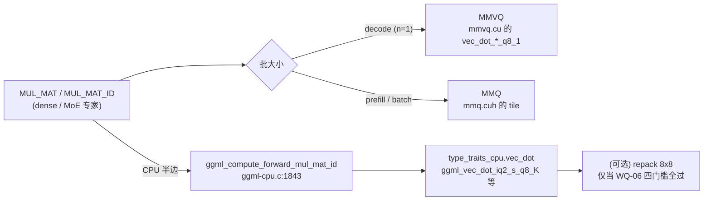

[中文](03-weight-quantization-and-kernels.md) · [English](03-weight-quantization-and-kernels.en.md)

# 03 Weights and quantization: format selection, mixed dtype, dequantization kernels and the coverage matrix

This chapter records the "weight-side" quantization selection and kernel work: why this UD-IQ3_XXS,
what is actually stored inside one file, why the two classes of dequantization kernels — IQ (codebook
table lookup) and Q (bit unpacking) — differ by nearly an order of magnitude in like-for-like
measurements on this machine, whether weight repacking (repack/8x8) is actually selected in this
repository, and the measured room for compressing weight bytes.

Time range: the evening of 2026-09-13, 18:09–19:26 (plus the prior 09-13 PLE/cache background). Every
number in this chapter is a "same-condition" measurement; any number that crosses sections or
configurations is labelled with its own basis separately, and no direct ranking is done.

- Previous chapter: [host/devpart](01-host-and-devpart.en.md)  Prediction and cache: [02](02-prediction-and-cache.en.md)
- Next chapter: [KV/TBQ/NXQ](04-kv-tbq-and-nxq.en.md)  Correctness and methodology: [05](05-correctness-and-methodology.en.md)
- Index: [README](README.en.md)  Historical source snapshots: [sources/](sources/)

---

## 0. Chapter boundary: what counts as "weights" and what does not

| Belongs to this chapter | Does not belong to this chapter (go to chapter 04) |
|---|---|
| GGUF tensor types (`iq2_s` / `iq4_nl` / `iq3_s` / `q6_K` / `q8_0` / `f32` / `bf16`) | KV cache types (`f16` / `q8_0` / `q4_0` / **`tbq3_0` / `tbq4_0`** / `nxq2_0` / `nxq3_0`) |
| Weight dequantization / `vec_dot` / repack / MMVQ / MMQ / `MUL_MAT` / `MUL_MAT_ID` | The K/V format of `FLASH_ATTN_EXT`, the FA allowlist, KV quantization quality (PPL/KLD) |
| Weight bytes (bpw, bytes per expert, prefetch bytes) | KV bytes → MoE cache slot count, cache zeroing in the 256k scenario |

**Easy to confuse (important)**: `tbq3_0` / `tbq4_0` / `nxq*_0` **are not weight formats**; they are
quantization types of the KV cache and belong to the KV-side tests. The raw records are in
`sources/handoff.md` §6.29 (snapshot lines 994–1018), §6.42 (snapshot lines 1475–1504),
§6.43–6.45 (snapshot lines 1505–1714); this chapter records only their intersection with the weight
side (kernel coverage, FA allowlist), and the full conclusions are in
[04-kv-tbq-and-nxq.md](04-kv-tbq-and-nxq.en.md).
Whenever this chapter uses `TQ`/`TBQ` for the KV-side TurboQuant types it always adds the "KV"
qualifier, to avoid confusion with the weight-side IQ.

---

## 1. Evidence levels, status labels and conventions

### 1.1 Status labels (uniform across the chapter)

| Label | Meaning |
|---|---|
| **Published** | The commit is on the release branch's native code baseline `7e01451b2` or is an earlier ancestor (`7e01451b2` already contains §6.34–6.37) |
| **WIP only** | The commit exists only in the source workspace history (after `7e01451b2`); the release branch does not contain this code |
| **Design only / analysis only** | There is documentation/analysis only, with no corresponding code change |
| **Retracted** | The code was written and measured, then reverted; the repository no longer contains it |
| **Still open** | There is a clear follow-up hook and a reopening condition |
| **Re-measured this time** | Numbers re-verified on 2026-09-14 by this chapter using read-only tools (not a new experiment) |

At the time, the HEAD of the release branch `master` was `0862af564` (= `7e01451b2` + one
documentation commit); when this chapter cites a source location: if it exists in `7e01451b2` it
writes `file:line`; if it exists only in WIP it writes only the commit hash and the identifiers
(no dead links are fabricated). The source workspace HEAD is `17ca0de85`, with additional uncommitted
changes.

### 1.2 Hardware and runtime environment (machine information provided by the user)

Ryzen 9 5950X (Zen 3, no AVX-512), DDR4-2666 128 GB, RTX A5000 Laptop 16 GB, PCIe 4.0 ×8.
Runtime SIMD as measured (first line of the raw log `sched-text-err.txt`):

```
CPU : SSE3 = 1 | SSSE3 = 1 | AVX = 1 | AVX2 = 1 | F16C = 1 | FMA = 1 | LLAMAFILE = 1 | OPENMP = 1 | REPACK = 1 |
```

Two things to note: ① `REPACK = 1` (the repack kernels **are compiled in**); ② in the CMakeCache of
the same build, `GGML_AVX2:BOOL=OFF`, `GGML_AVX512:BOOL=OFF`, while `GGML_NATIVE:BOOL=ON`
⇒ the explicit switches are off and the build actually goes through `-march=native` (see §6.38,
snapshot lines 1328–1370).

### 1.3 Conventions

- Line numbers always refer to the **snapshot files under `sources/`**. Every snapshot begins with an
  **11-line** archival note (from the "historical source snapshot" heading to the separator line),
  so **original line number = snapshot line number − 11**; this chapter cites handoff by section
  number plus (snapshot line), and other snapshots by `file name:snapshot line`. Convert accordingly
  when the original line numbers need to be checked.
- **microbench ≠ end-to-end**: the GB/s of `test-quantize-perf` describes only the operator cost of a
  single-core `vec_dot` and does not represent token time; wherever this chapter cites a microbench it
  also gives that microbench's share of the end-to-end figure.
  (**Note**: the `GB/s` printed by that tool is actually **GiB/s**, see the correction in WQ-08 §9.1;
  before comparing with the decimal GB/s of PCIe it must be multiplied by ×1.073 741 824.)
- **Effective GB/s does not rank formats against each other**: `X GB/s (quantized bytes)` is also
  affected by bpw, so it is comparable only under the same byte basis; the meaningful converted
  quantity is "weights/second". See §13.

### 1.4 Timeline (deciding "published" or "WIP only")

| Commit | Time (2026-09-13) | Content | Status |
|---|---|---|---|
| `297b60792` | 18:09 | §6.34 evaluation of the AVX2 operators for IQ4_NL | Published |
| `7baae92dc` | 18:12 | §6.35 real type distribution + correction to 6.34 | Published |
| `7e01451b2` | 18:19 | §6.36 mixed-type addressing audit + §6.37 compression evaluation; **release-branch native code baseline** | Published |
| `8a0bb3b7f` | 18:23 | §6.38 kernel coverage matrix | WIP only |
| `79ff52883` | 18:31 | §6.39 measured CPU operator efficiency | WIP only |
| `c8a581cc0` | 18:33 | §6.40 AVX2 repack boundaries and payoff (pure analysis, no code) | WIP only |
| `4aaef90b9` | 18:39 | §6.41 two AVX2 experiments (code already reverted) | experiment code **retracted** |
| `0d3d6c9d9` | 19:26 | iq4_xs 8x8 repack (**not written into the body of §6.41**) | WIP only, **still open** |

> Narrative position: the weight/kernel line **is not** the starting point of this project. The
> project's first line is the PLE cache (see [00 research chronology](00-research-chronology.en.md)
> and [02](02-prediction-and-cache.en.md)); the entry question of this chapter comes precisely from
> the PLE side: "that IQ4_NL AVX2 dot/repack operator in the repository, can it help the MoE cache?".
> So every conclusion in this chapter is a "side-line payoff evaluation" and must not be taken as the
> starting point of the main line.

---

## 2. WQ-01: Why this quantization (UD-IQ3_XXS) — selection and the label trap

| Field | Content |
|---|---|
| **Route ID** | WQ-01 |
| **Status/version** | Published (fact baseline; `7e01451b2` contains the correction to its label) |
| **Why it was attempted** | The model comes from an **externally fixed quantization** (unsloth's UD dynamic quantization recipe); the file name nominally says `IQ3_XXS` and `ftype` reports `IQ3_XXS - 3.0625 bpw`. The project setup is a **partial-offload path with 128 GB of main memory + a 16 GB GPU**, while also leaving room for the 256k KV and the MoE expert cache. **This was not a selection experiment** — this project never ran a rigorous recipe comparison (quality/size/speed) |
| **Technical mechanism** | The nominally 3.0625 bpw "UD (dynamic quantization)" recipe: inside one file it mixes several types by tensor sensitivity; `ftype`/the file name reflect only the **recipe name**, not the true type of any single tensor |
| **Experimental conditions and evidence** | Model `Qwen3.8-Flash-Next-UD-IQ3_XXS-0000{1,2,3}-of-00003.gguf` (10.9 MB + 46.16 GiB + 30.16 GiB; 1224 tensors in total, 76.31 GiB of weights in total). For the runtime `ftype` line see any `*-out.txt` (for example the headers of `t-auto-out.txt`, `guard-1-out.txt`). For the type distribution see WQ-02 |
| **Observations and limits of the conclusions** | The early engineering documents wrote `IQ3_XXS` into the boundary assumptions as a "weight type": line 41 of `sources/moe-decode-perf-plan.md` and line 53 of `sources/rebuild-spec.md` list "IQ3_XXS dequantization and the GEMM kernel" as one of the parts that are fixed and not to be changed; line 193 of `sources/rebuild-spec.md` writes "quantization type unchanged, tensor shapes unchanged". **Without knowing better this was reasonable** — what really needed correcting was only the fact itself, namely "our expert weights are IQ3_XXS" (§6.34 → §6.35 correction) |
| **Reason for keeping/dropping** | Keep: changing the quantization = re-quantizing the whole model, the quality would change, and that is a model recipe decision, not an engineering optimization |
| **Open issues / reopening conditions** | If the recipe is to be touched: a UD variant with `down=iq2_s/iq3_s` is needed in order to actually measure the payoff and the quality cost (§6.37 conclusion 4) |

**Boundary**: this chapter has no first-hand record of "why we chose UD and not another recipe". The
original selection comparison (quality/size) is not inside this workspace and **was never done**. All
that can be established is: ① the model is an externally given GGUF;
② the project runs in a **partial-offload** shape of 76.31 GiB of weights + 128 GB of main memory +
a 16 GB GPU (loading table in WQ-06 §7.2: CUDA0 3.8 GiB / CUDA_Host 45.8 GiB / CPU_Mapped 26.8 GiB,
**it is not "the whole model stuffed into the GPU"**); ③ the engineering consequence of this is "the
label misleads decisions".
Any citation of a "reason for the selection" can only cite these three items and must not be written
as "the optimal recipe selected by some metric".

---

## 3. WQ-02: The real mixed-dtype distribution and the byte accounting

| Field | Content |
|---|---|
| **Route ID** | WQ-02 |
| **Status/version** | Published (§6.35, snapshot lines 1236–1269, commit `7baae92dc`) + **re-measured this time** (2026-09-14) |
| **Why it was attempted** | The conclusion of §6.34 rested on the false premise "our experts are IQ3_XXS"; to judge any operator/assembly decision one must first know the real per-tensor type |
| **Technical mechanism** | Read the GGUF **header** (not the tensor data) to build the type histogram and per-tensor bytes; `tools-gguf-types.py` |
| **Experimental conditions and evidence** | Three shards + `tools-gguf-types.py <shard>`; geometry self-check `tools-gguf-types.py <shard> --check` |

### 3.1 Type histogram (re-measured by this chapter on 2026-09-14, reading only the file header)

| Type | Tensor count | Bytes | Share |
|---|---|---|---|
| **`iq4_nl`** | 49 | **47.91 GiB** | 62.8% |
| **`iq2_s`** | 94 | 23.52 GiB | 30.8% |
| `q6_K` | 250 | 3.10 GiB | 4.1% |
| `q8_0` | 248 | 0.79 GiB | 1.0% |
| `iq3_s` | 2 | 0.67 GiB | 0.9% |
| `f32` | 557 | 0.29 GiB | 0.4% |
| `bf16` | 24 | 0.03 GiB | 0.04% |
| **Total** | **1224** | **76.31 GiB** | 100% |

Points where this agrees with the historical table in §6.35: `iq4_nl` 49 tensors / 47.9 GiB / 63%,
`iq2_s` 94 / 23.5 GiB / 31%, `q6_K` 250 / 3.1 GiB / 4%, `q8_0` 248 / 0.8 GiB / 1%.
**Only the merged "other" row differs slightly**: the historical table writes
`f32/bf16/iq3_s = 560 tensors / 1.2 GiB / 1%`, while this re-measurement gives 583 tensors /
0.99 GiB / 1.3% (`f32` 557, `bf16` 24, `iq3_s` 2).
The difference falls only on that merged row and does not change any conclusion; when citing, use this
section's re-measured values, and keep the historical values for traceability.

⇒ The **`IQ3_XXS` in the file name is not the type of any single tensor** (it is the recipe name), and
**`iq4_nl` is the largest share**. The `IQ3_XXS - 3.0625 bpw` reported by the `ftype` line is therefore
metadata that misleads kernel and assembly decisions.

### 3.2 The real geometry and bytes of the expert tensors

| Tensor | Type | Per tensor | `ne` | Tensor count |
|---|---|---|---|---|
| `blk.N.ffn_gate_exps.weight` | `iq2_s` (only blk.2 is `iq3_s`) | 256.25 MiB (blk.2: 343.75 MiB) | `[2560, 640, 512]` | 47 (+1) |
| `blk.N.ffn_up_exps.weight` | `iq2_s` (only blk.2 is `iq3_s`) | 256.25 MiB (blk.2: 343.75 MiB) | `[2560, 640, 512]` | 47 (+1) |
| `blk.N.ffn_down_exps.weight` | **`iq4_nl`** | **450.00 MiB** | `[640, 2560, 512]` | 48 |

(144 expert tensors in total = the 47 + 1 and the 47 + 1 of gate/up, plus 48 down;
`iq2_s` totals 94 and `iq3_s` 2 — self-consistent with the type histogram in 3.1.
Another consistency check: `iq4_nl` totals 49 tensors = 48 down + `per_layer_token_embd`.)

- Bytes per expert = 524 800 (gate) + 524 800 (up) + 921 600 (down) = **1 971 200 B = 1.88 MiB**;
  of which **down accounts for 46.8%** (decided by the recipe, unrelated to the admission policy).
- Model metadata (`sched-text-err.txt`): `n_expert = 512`, `n_expert_used = 10`.
- **PLE table**: `per_layer_token_embd.weight` = `iq4_nl` = **27 465.95 MiB (26.82 GiB)**, a single
  tensor. This is exactly the 27 465.95 MiB of the CPU-side `CPU_Mapped` buffer (see the loading table
  in WQ-06) — i.e. that IQ4_NL path for which "the PLE cache should use it" (§6.35).

### 3.3 Byte accounting and two numbers with different bases

Counting 48 layers and `n_expert_used = 10` (recomputed in this chapter):

- The full expert set of one layer = 19.71 MB (1.88 MiB × 10);
- The full expert set per token ≈ **901.9 MiB/token**;
- At an 80% hit rate the real misses ≈ **180 MiB/token** (consistent with the "~180 MB/token" of §6.39);
- **Each additional admitted rank ≈ 1 more expert per layer ≈ 48 × 1.88 MiB = 90.2 MiB/token**
  — agreeing with the "92.5–103.8 MB/token in total" of §6.35 (with the gate 26.6% / up 26.6% /
  down 46.8% proportions) and with the measured "≈100MB/token per tier" of §6.6.

- **Two numbers that must not be mixed up**: the 92.5–103.8 MB/token of §6.35 is the **marginal bytes
  per tier (per additional admitted rank)**; the `pre ≈ 630 MB/token` of §6.39 is the **total prefetch
  bytes back-derived from the 0.073 ms/MB marginal**.
  **Arithmetic correction**: `49.3 ms ÷ 0.073 ms/MB = 675 MB`, not 630 MB — the handwritten 630 cannot
  be reproduced from that division; this chapter keeps the historical value 630 for traceability while
  also giving the recomputed value 675. **Neither of them is a DMA measurement**:
  the 161 / 254 / 464 MB/tok measured directly in §6.6 (at 40.2 / 46.9 / 58.2% hits) is the primary
  evidence for the prefetch volume, and its marginal itself rises with volume
  (0.073 → ~0.09 ms/MB), so extrapolating with a constant marginal is only an order-of-magnitude
  estimate. The only use of that order-of-magnitude estimate is "the CPU kernel is not the bottleneck"
  (see WQ-08); it is not an acceptance number.

### 3.4 Limits of the conclusions

- The byte distribution holds **only for this one GGUF**; switching to any other UD variant (for
  example down switched to `iq2_s`) requires re-measurement.
- `--check` verifies geometry only (see WQ-03); it **does not verify numerical quality**.
- The re-measurement tool reads only the file header: it does not load the model and does not read
  tensor data, so it can safely be run over and over.

---

## 4. WQ-03: Addressing audit and runtime insurance under mixed types (UD)

| Field | Content |
|---|---|
| **Route ID** | WQ-03 |
| **Status/version** | Published (§6.36, snapshot lines 1270–1296, commit `7e01451b2`) |
| **Why it was attempted** | The cache addresses by "row/expert offset", while the block geometries of `iq2_s` / `iq4_nl` / `iq3_s` are completely different (256/82, 32/18, 256/110). Anywhere that treats the row size as a constant will be **silently misaligned** — this is a new risk of UD quantization and must be audited |
| **Technical mechanism** | Per-tensor geometry: the bytes per expert take **that tensor's own** `nb[2]`; the block bytes take **that tensor's own** `ggml_type_size`; each component's start is aligned to **its own** `type_size` (floor 512); the slot stride is aligned to the **LCM of all components' `type_size`**, ensuring that `nb[2] / type_size` divides evenly; if the expert counts disagree the cache is **disabled** rather than guessed at |
| **Experimental conditions and evidence** | Code locations (all present in `7e01451b2`): `ggml/src/ggml-backend.cpp:3107` (`expert_size = input->nb[2]`), `:3108` (`type_size`), `:3209-3212` (comment and `bundle_alignment`), `:3215` (expert counts disagree → disable), `:3220` (align by `max(type_size,512)`), `:3223-3232` (LCM → `bundle_stride`). The original comment states the reason itself: "512 alone is not divisible by e.g. IQ3_XXS' 82". There is no hard-coded type constant anywhere in the file |
| **Observations and limits of the conclusions** | Verified against this model: gate/up `iq2_s` 820 B/row × 640 = 524 800 B, `% 82 == 0`; down `iq4_nl` 360 B/row × 2560 = 921 600 B, `% 18 == 0`. Geometry self-check (re-measured this time, shards 2/3): **PASS (468 + 756 = 1224 tensors)**, consistent with the 1224 all-PASS recorded in §6.36 |
| **Reason for keeping/dropping** | Keep. This is the insurance that turns "silent misalignment" into an explicit error when the quantization is changed in the future; this model ran 256 token with no false positives, and `slots = 97` is normal |

**Slot geometry recomputation (2026-09-14, recomputed step by step from the
`moe_cache_component_stride`/LCM code of `7e01451b2`)**

| Layer shape | Components (in order) | payload (sum of the three tensors' `expert_size`) | bundle stride | Alignment waste |
|---|---|---|---|---|
| Regular layer (gate/up `iq2_s` + down `iq4_nl`) | 524 800 + 524 800 + 921 600 | **1 971 200 B** | **2 078 208 B = 11 × 188 928** (`lcm(512,82,18)`) | **107 008 B** |
| blk.2 (gate/up `iq3_s` + down `iq4_nl`) | 704 000 + 704 000 + 921 600 | 2 329 600 B | **2 534 400 B = 10 × 253 440** (`lcm(512,110,18)`) | 204 800 B |

- **Correcting an arithmetic error in the handwritten notes**: §6.36 writes "alignment waste
  9728 B = 0.47%". With the same set of numbers, `2 078 208 − 1 971 200 = 107 008 B`;
  `9 728 = 107 008 / 11`, i.e. the handwritten note is short by one order of magnitude.
  The correct relative figures are **5.43% of the payload and 5.15% of the stride** (regular layer).
- Basis of the recomputation (can be rerun): `moe_cache_component_stride()` =
  `expert_size + ceil(512/type_size)*type_size` (`ggml/src/ggml-backend.cpp:2931-2934`);
  component start = `align_up(offset, max(type_size,512))` (`:3220`);
  `bundle_stride` = `align_up(end offset, lcm(all components' type_size))` (`:3223-3232`).
- This also explains where another number comes from: line 40 of
  `sources/moe-cache-score-aware-prd.md` says "the shared-pool pitch of 2 534 400 bytes is not
  divisible by the 82-byte quantization block" — **2 534 400 is exactly the stride of the blk.2 layer**
  (`2 534 400 % 82 = 26`, whereas for a regular layer `2 078 208 % 82 = 0`). That text belongs to the
  **later shared-pool (global single pitch) policy** design (a WIP document); **it is not an earlier
  problem on this chapter's timeline, nor can it be said to have been solved by the per-layer LCM**;
  it falls under cache policy, whose main description is in
  [chapter 02](02-prediction-and-cache.en.md), and this chapter records only that numeric
  correspondence.

| **Open issues / reopening conditions** | **`--check` must be rerun whenever the recipe or the arch changes** (PASS is a necessary condition, not a sufficient one: it covers only "each tensor's `expert_size` is an integer multiple of the block bytes", not "each layer's stride divides evenly by its components' block sizes" — the latter is guaranteed by the LCM, but once a single stride shared across layers is introduced (such as the global pitch in the table above), that guarantee may fail) |

---

## 5. WQ-04: Evaluating the room for cache compression (conclusion: essentially none)

| Field | Content |
|---|---|
| **Route ID** | WQ-04 |
| **Status/version** | Published (§6.37, snapshot lines 1297–1327, commit `7e01451b2`; historical report only, **the raw log was not located in this workspace**) |
| **Why it was attempted** | Prefetch bytes are the bottleneck (§6.6); the most direct idea is "compress the weight bytes that have to be moved" |
| **Technical mechanism** | ① Losslessly compress the raw bytes of the GGUF tensors (zlib -9 / lzma, first 4 MiB sample); ② analyse the share taken by the "metadata" (scale etc.) in the block structure; ③ the cache's own layout waste; ④ switch to a format with a lower bpw |
| **Experimental conditions and evidence** | See the table below (§6.37) |

Measured lossless compression (first 4 MiB of raw bytes):

| Tensor | Format | zlib -9 | lzma |
|---|---|---|---|
| `blk.0.ffn_down_exps` | `iq4_nl` | **98.3%** | 98.9% |
| `blk.0.ffn_gate_exps` | `iq2_s` | **99.8%** | 100.0% |

⇒ On that sample, the lossless-compression gain on quantized weights is **under 2%** (98.3% / 99.8%
for the two tensors); that is, "even the 11–12% fp16 `d`/`scales` fields were not compressed away" is
an observation made on **this sample and with this method**, and must not be generalised into "no
compression / no encoding has any room".

The arithmetic of "shrinking the metadata" (block structures in `ggml-common.h`,
QK_K = 256 / QK4_NL = 32):

| Tensor | Format | Block | Metadata | Share | Off-the-shelf alternative | Converted to total prefetch bytes |
|---|---|---|---|---|---|---|
| gate/up | `iq2_s` | 82 B | d2 + scales8 = 10 B | 12.2% | `iq2_xxs` (−9.8%) | −5.2% |
| down | `iq4_nl` | 18 B | d2 | 11.1% | **`iq4_xs` (−5.6%)** | **−2.6%** |
| blk.2 gate/up | `iq3_s` | 110 B | 6 B | 5.5% | — | — |

- The cache's own layout waste is **5.15%** (recomputed in WQ-03: regular layer stride 2 078 208 B vs
  payload 1 971 200 B ⇒ 107 008 B; the 0.47% in the handwritten notes is an arithmetic error). This
  item is **much larger than the handwritten note**, and **whether the layout overhead can be
  recovered and at what cost was not verified this round** — the erroneous 0.47% cannot be used to
  rule it out.
- A 43 ms prefetch would only fall to ~41.9 / ~40.8 ms ⇒ **not worth it**.

**Among the compression classes evaluated, only "lowering bpw" shows a double-digit-percentage byte
lever** (§6.37 conclusion 4) — note that this is a model recipe decision, not an engineering
optimization:

| Action | Byte effect | Side effect |
|---|---|---|
| down switched from `iq4_nl` (4.5 bpw, 46.8% of prefetch) to `iq2_s` (2.5625 bpw) | Total prefetch bytes **−20%** (43 → 34 ms, [INFERENCE] +2 t/s order) | Each slot 20% smaller ⇒ 97 → ~121 slots, hits move up another tier; but **the model quality would change**, a recipe decision |

**The boundary of the boundary (preconditions)**: if the aim is to save *PCIe bytes*, compression
only makes sense if the **GPU decompresses directly** (otherwise the decompressed data still has to be
transferred in full); if the aim is to save *VRAM* (more slots), **the byte-reduction candidate
obtained from this analysis is lowering bpw** (as in the table above) — whether the layout overhead
(5.15%) can be recovered and at what cost **was not verified this round**, so it is not written here
as "the only way".
This section **did not** prototype GPU decompression, nor did it measure any end-to-end "compress and
then transfer" scenario.

- Open / reopening: a UD variant with `down=iq2_s/iq3_s` is needed in order to measure the real
  (speed + quality) payoff.

---

## 6. WQ-05: First evaluation — is the IQ4_NL AVX2 dot/repack operator of any use for this model

| Field | Content |
|---|---|
| **Route ID** | WQ-05 |
| **Status/version** | Published (§6.34, snapshot lines 1201–1235, commit `297b60792`; **conclusion kept, the evidence was corrected twice**) |
| **Why it was attempted** | The repository already has an "off-the-shelf" set of 4-bit repacking acceleration operators; if they could be used, it would speed up the CPU-side dot for free — this is the original motivation of this line |
| **Technical mechanism** | The `iq4_nl_4x4/8x8/16x1` gemv/gemm in `ggml/src/ggml-cpu/repack.cpp` (`block_iq4_nlx4/x8/x16`) + the AVX2 implementation in `arch/x86/repack.cpp` (`vpshufb` table lookup); the entry assertion `GGML_ASSERT(t->type == GGML_TYPE_IQ4_NL)` restricts it to taking effect on IQ4_NL tensors only |
| **Experimental conditions and evidence** | Code locations (`7e01451b2`): `ggml/src/ggml-cpu/repack.cpp:3602/3659/3716` (the three assertions), `:4558` (`iq4_nl_8x8_q8_0` traits), `:4670-4676` (the AVX2 branch). Single-core `test-quantize-perf --op vec_dot_q`: the tool shows `iq4_nl` **12.62**, `q4_0` **11.70**, `q8_0` **32.00** (§6.34; **no raw log saved, historical report only**). **Units follow the correction in WQ-08 §9.1**: the tool's displayed values are actually GiB/s ⇒ decimal **13.55 / 12.56 / 34.36 GB/s** |
| **Observations and limits of the conclusions** | ① In one instrumented decode graph (total 55.4 ms), **within the timing window** the CPU side was only 0.7 ms (≈1.3%). This is a **share within the window**, not a strict upper bound on the critical path: the timer's items already overlap each other (the original handwritten table carries a "has overlap" annotation), and asynchronous overlap means "all dot cost is inside this 0.7 ms" **cannot be proven from that data** — so 1.3% can only be read as "under the accounting method of this one measurement, the CPU side is a small term"; ② changing the format would make the real wall worse: `iq4_nl` 4.5 bpw vs the ≈3.06 bpw nominally claimed by the `IQ3_XXS` file name ⇒ 47% more bytes, and the wall is prefetch PCIe contention (measured marginal in §6.6: 0.073 ms/MB ≈ 13.8 GB/s, decimal); ③ with the corrected units, "dot has headroom" still holds: `iq4_nl` 13.55 GB/s, `q8_0` 34.36 GB/s (decimal) vs the PCIe supply of about 5 GB/s (decimal) ⇒ about 2.7× headroom |
| **Reason for keeping/dropping** | **Dropped (for MoE)**: not because "the operator is bad", but because under that timing basis the CPU side is a small term and changing the format would worsen prefetch. **Do not** take a microbench speedup ratio for a token gain |
| **Open issues / reopening conditions** | The connection between this operator and `per_layer_token_embd` (26.8 GiB, `iq4_nl`) is recorded in §6.35, but that is only "same origin of use", **not the same as "turning on the PLE cache lets you use repacking"**. The real precondition is that the three items listed in WQ-06 hold simultaneously (the format is in the supported set / the tensor lands in the repack buffer / the in-graph operator is `MUL_MAT` (2D) or `MUL_MAT_ID` (3D)). This model currently does not satisfy the third. **Artificially turning PLE row gathering into a GEMM is not an established direction of this project**, and this chapter does not recommend it |

**§6.34 table: breakdown of a single decode graph (55.4 ms)**

> Basis: the `MOE-CACHE` timer prints per decode graph, and **the items overlap each other** (the
> original table itself notes "has overlap", so the shares sum to >100%). The "share" column below is
> a **share within the window**, not a strict breakdown of the critical path.

| Stage | Time | Share |
|---|---|---|
| Prefetch (expert weight H2D / cache fill) | **43 ms** | **78%** |
| `ids_wait` (round-trip latency of reading back the routing ids per layer) | **17.8 ms** | **32%** (overlaps the above, hence a total >100%) |
| GPU enqueue | 7.6 ms | 14% |
| Partition | 2.7 ms | 5% |
| **CPU side (timer basis)** | **0.7 ms** | **1.3%** |

The original table annotates this spot with "(all dots are here)". This chapter does not treat that as
an established fact: that timer item measures the CPU side's time within the window, and it **cannot
prove** that the other items (such as `pre`, `smoe`) contain no parallel dot work.

Raw log: a measured line in the same format as this breakdown can be found in `c1-3-err.txt`, one
sample of exactly the same magnitude —
`total=55.4 ms | ids_wait=18.1 ms partition=2.71 ms cpu=0.7 ms gpu_queue=7.8 ms pre=43.2 ms
mrs=0.40 ms prefetch_submit=1.51 ms smoe=0.73 ms` (the same shape also appears in `f-a3-err.txt`,
`hd-nb3-a-err.txt`, `t-def-err.txt`).
**Boundary**: this chapter cannot map every cell of the §6.34 table to one particular run (the table
values are a consolidation of samples of that class, rounded to one decimal place); the four logs
cited are **samples of the same class and the same basis**, not proof that "§6.34 is exactly this one".

---

## 7. WQ-06: Is weight repacking (repack / 8x8) actually selected

| Field | Content |
|---|---|
| **Route ID** | WQ-06 |
| **Status/version** | Mixed: the mechanism is **published** (the code paths of `7e01451b2`), while the measured evidence for "zero allocation" comes from the WIP batch after `8a/79ff` (logs saved) |
| **Why it was attempted** | §6.34 wrote the reason as "format mismatch", §6.35 changed it to "the repack buft was never selected, but the reasoning was that the source contains no occurrence of `repack`", and §6.41 corrected it again to "the mechanism is generic". The three statements must converge into one verifiable chain |
| **Technical mechanism** | Four independent gates, none of which may be missing (see below) |
| **Experimental conditions and evidence** | Source (`7e01451b2`) + loading log (`sched-text-err.txt`) |

### 7.1 The chain (every step is verifiable)

```
① 注册   ggml-cpu.cpp:42-66  ggml_backend_cpu_get_extra_buffer_types() 含 ggml_backend_cpu_repack_buffer_type()
         ggml-cpu.cpp:76-86  暴露给 ggml_backend_dev_get_extra_bufts
② 入选   llama-model.cpp:1068-1078  make_cpu_buft_list() 把 extra bufts 放进 CPU 候选表
③ 选型   llama-model-loader.cpp:1060-1071  select_weight_buft() 取第一个"支持"的 buft
         llama-model-loader.cpp:920-1054  weight_buft_supported(): 用候选 buft 造一个 dummy 缓冲，
                                         再问 ggml_backend_dev_supports_op(dev, op_tensor)
④ 判定   ggml-cpu.cpp:424-438  CPU supports_op 检测到 extra buft 时转交 buf_extra->supports_op()
         repack.cpp:4781-4814  repack 的 supports_op()：仅接受
                                 op == MUL_MAT    且 src0 是 2 维  且 src0 已在 repack 缓冲
                                                 且 get_optimal_repack_type(src0) != nullptr
                             或 op == MUL_MAT_ID 且 src0 是 3 维（同上）
                               （src1 必须在 host、且类型为 F32）
```

### 7.2 Measured evidence: registered, but zero allocation

The loading table of `sched-text-err.txt` (`--verbose`):

```
load_tensors:        CUDA0 model buffer size =  3816.16 MiB
load_tensors:    CUDA_Host model buffer size = 46872.31 MiB   ← MoE 专家（45.8 GiB）
load_tensors:   CPU_Mapped model buffer size = 27465.95 MiB   ← per_layer_token_embd（26.8 GiB, iq4_nl）
```

**There is no `CPU_REPACK ... model buffer size` line at all** ⇒ the repack buffer is registered, but
zero allocation.

### 7.3 Why this model is certain not to be selected (the mechanism conclusion added by this chapter)

- The **MoE experts** (`iq2_s`/`iq4_nl`/`iq3_s`, 144 tensors) are pinned to the **CUDA_Host** large
  buffer (45.8 GiB, serving the SMoE cache) ⇒ they are not in the CPU candidate list, and
  **CPU repack cannot structurally act on them**.
- The **only large quantized tensor on the CPU side** is `per_layer_token_embd` (26.8 GiB, `iq4_nl`),
  which lands in `CPU_Mapped`. Its in-graph operator is **`GET_ROWS`** (the schedule scan in §6.38: on
  the CPU there are only `MOE_CPU` / `GET_ROWS` / blk.47's unfused `MUL_MAT_ID`+`SWIGLU`) — whereas
  repack's `supports_op` recognises only `MUL_MAT` / `MUL_MAT_ID` (repack.cpp:4783, :4800)
  ⇒ `GET_ROWS` misses outright, so repacking does not apply.
- Next, the static type ids also show that repack types **do not enter the file format**:
  `GGML_TYPE_IQ4_NL_4_4/4_8/8_8` in `ggml.h:421-428` are commented as historical ids, and entries
  36/37/38 in `ggml.c:944-957` read `"... REMOVED, use IQ4_NL with runtime repacking"` ⇒ repacking is
  a **runtime** behaviour, unrelated to the types in the GGUF.

**Conclusion**: the conclusion of `§6.34` (no help for this model's MoE) holds; `§6.35`'s "never
selected" holds; and `§6.41`'s correction to the **reasoning** also holds (the mechanism is generic,
and the string `repack` does not occur in the source).
Neither correction is a "conclusion flip" — rather, the evidence converges step by step onto the
verifiable chain in §7.3.

- Open / reopening conditions: **all three must hold simultaneously** — ① the tensor type is in the
  supported set of `ggml_repack_get_optimal_repack_type()` (on x86 AVX2 there is currently only
  `IQ4_NL`, and it needs `ne[1] % 8 == 0`); ② the tensor is assigned to a repack buffer (not
  CUDA_Host / `CPU_Mapped`); ③ the in-graph operator is `MUL_MAT` (2D weights) or `MUL_MAT_ID` (3D
  weights) (`repack.cpp:4781-4814`). For this model currently: **the expert tensors fail ②** (they are
  in the CUDA_Host buffer), and **PLE fails ③** (its in-graph operator is `GET_ROWS`).
  When the three do not hold simultaneously, the repack code stays idle on this model.

---

## 8. WQ-07: Kernel coverage matrix (format × compute path × backend)

| Field | Content |
|---|---|
| **Route ID** | WQ-07 |
| **Status/version** | WIP only (§6.38, snapshot lines 1328–1370, commit `8a0bb3b7f`; the release baseline does not contain this section's document, but the kernel coverage it cites already exists in `7e01451b2`) |
| **Why it was attempted** | To rule out the whole class of explanations "some path degrades to f16/cuBLAS or a bare fallback" |
| **Technical mechanism** | Read the dispatch tables backend by backend + measure the schedule |
| **Experimental conditions and evidence** | Source locations + a `GGML_SCHED_DEBUG=2` scan (`tools-op-backend-scan.py`, raw logs `sched-text-err.txt`, `sched-vis-err.txt`) |

### 8.1 Coverage table

| Type | CPU `vec_dot` (activation quantization) | CUDA decode MMVQ | CUDA prefill MMQ | Used in |
|---|---|---|---|---|
| `IQ2_S` | `ggml_vec_dot_iq2_s_q8_K` (Q8_K) | `vec_dot_iq2_s_q8_1` | has case + tile | MoE gate/up (94 tensors) |
| `IQ3_S` | `ggml_vec_dot_iq3_s_q8_K` (Q8_K) | `vec_dot_iq3_s_q8_1` | has | MoE gate/up (blk.2) |
| `IQ4_NL` | `ggml_vec_dot_iq4_nl_q8_0` (Q8_0) | `vec_dot_iq4_nl_q8_1` | has | MoE down (48), PLE |
| `Q6_K` | `ggml_vec_dot_q6_K_q8_K` (Q8_K) | `vec_dot_q6_K_q8_1` | has | attention, some weights |
| `Q8_0` | `ggml_vec_dot_q8_0_q8_0` (Q8_0) | `vec_dot_q8_0_q8_1` | has | embeddings/some weights |

Code locations (`7e01451b2`): on the CPU side `ggml/src/ggml-cpu/ggml-cpu.c:369` (IQ3_S), `:375`
(IQ2_S), `:393` (IQ4_NL), plus the corresponding entries for Q6_K/Q8_0; for the activation
quantization type see each entry's `vec_dot_type`.
CUDA decode `ggml/src/ggml-cuda/mmvq.cu:29/33/35` (plus the vectorization parameters of
`get_vdr_mmvq()`); prefill `ggml/src/ggml-cuda/mmq.cuh:88/90/95` (DS layout), `:410/412/415`
(tx configuration), `:1589/1591/1592` (`DECL_MMQ_CASE`).
⇒ **Both sides have accelerated operators; there is no "bare fallback"**; nor does the decode path
have a branch that degrades to f16/cuBLAS.

### 8.2 Call chain (weight side)



- FA (`FLASH_ATTN_EXT`) is **not on the weight chain**: its type parameters are K/V cache types
  (`f16`, `q8_0`, `q4_0`, `tbq4_0`, etc.), belonging to the KV side →
  [chapter 04](04-kv-tbq-and-nxq.en.md). This chapter records its existence only in the "coverage
  matrix" (`ggml/src/ggml-cuda/ggml-cuda.cu:2385/5564`) and draws no conclusion about its behaviour.

### 8.3 Schedule measurements (raw logs, scan script rerun on 2026-09-14)

| Log | Parsed nodes | CUDA0 | CPU | CPU share | Operators on the CPU |
|---|---|---|---|---|---|
| `sched-vis-err.txt` (with vision) | 97 726 | **97 228** | **498** | 0.5% | `MOE_CPU` ×438, `GET_ROWS` ×40, `MUL_MAT_ID` ×15 (blk.47), `SWIGLU` ×5 |
| `sched-text-err.txt` (text only) | 82 447 | 81 967 | 480 | 0.6% | as above (`GET_ROWS` ×34, `MUL_MAT_ID` ×6, `SWIGLU` ×2) |

- The "97228 nodes on CUDA0 / 498 on CPU (0.5%)" written in §6.38 corresponds to
  **`sched-vis-err.txt`** (exactly reproduced in this rerun); the text-only path is a different set of
  numbers. Both are kept; do not mix them up.
- On the CPU there are only three kinds: `MOE_CPU` (by design,
  `ggml/src/ggml-cuda/ggml-cuda.cu:5615` explicitly `return false`), `GET_ROWS` (`token_embd` +
  `per_layer_token_embd`, deliberately left on the host: the tensors reside on the host, saving one
  D2H), and **blk.47's unfused `MUL_MAT_ID`/`SWIGLU`** (the last layer has no side-graph prediction —
  the boundary of `smoe_target = il + ahead < n_layer` — so the split did not take it over). The cost
  is already counted in the 0.7 ms of the CPU side, negligible, but recorded as a known boundary.
- 4 splits per layer (one pair of host leaves each for gate/up/down + 1 CPU MoE) ⇒ about
  192 splits/token.
- Vision path: `IM2COL` ×4 and `UPSCALE` ×2 are all on CUDA0; **no `POOL_*`/`WIN_*` appears**
  ⇒ those operators without CUDA are irrelevant to this model.
- **A historical statement that does not hold (a counterexample found in this verification)**: §6.38
  writes "`GGML_OP_MOE_PARTITION_APPLY` has 0 references in the entire source (a dead enum entry)".
  In the actual source **this identifier does not exist** (`GGML_OP_MOE_PARTITION_APPLY` has 0 hits
  across both worktrees). The real enum entries are `GGML_OP_MOE_PARTITION_IDS` /
  `GGML_OP_MOE_PARTITION_WGT` (`ggml/include/ggml.h:601-602`), and they **are actually referenced**
  (`ggml/src/ggml-backend.cpp:1365, 4653`, `ggml/src/ggml-cuda/ggml-cuda.cu:2379/2382/5522`).
  ⇒ The sub-conclusion "dead enum" **does not hold**; do not copy it.

---

## 9. WQ-08: Measured CPU operator efficiency — why "low bit width" does not mean "fast"

| Field | Content |
|---|---|
| **Route ID** | WQ-08 |
| **Status/version** | WIP only (§6.39, snapshot lines 1371–1414, commit `79ff52883`) |
| **Why it was attempted** | To answer "can the CPU side be sped up by maxing out 4n/repass", the real single-core throughput of the i-quants has to be obtained first |
| **Technical mechanism** | `tests/test-quantize-perf.cpp` originally **skipped types without `from_float` outright**, so the i-quants were all **never measured at all**. The patch: for such types it fills with **raw bytes** instead. **The validity of that method is limited**: filling with raw bytes bypasses the quantization path, and it does not guarantee that the codebook-index hit distribution, the actual range of the scales, or the data hotness agree with real weights; nor does it **cover numerical correctness** — so these numbers should be read as "a relative comparison under raw-byte filling", not as absolute values equivalent to the real weight distribution (the handwritten notes call it "data-independent"; this chapter does not adopt that strong assertion). `build-cli.bat` gains an optional target argument (that helper is a gitignored local script) |
| **Experimental conditions and evidence** | Code evidence consistent with the root cause of the missing `from_float`: `ggml/src/ggml-cpu/ggml-cpu.c:364-366, :373` explicitly comment `from_float for iq3 and iq2_s was removed because these quants require initialization in ggml_quantize_init`, and are commented out ⇒ the skipping is a "blind spot of the test tool", not a missing kernel |

### 9.1 Measured single-core `vec_dot` (§6.39; **no raw log saved, historical report only**)

> **Unit correction (important)**: `gigabytes_per_second()` of `test-quantize-perf` actually divides by
> 1024³ while printing `GB/s` (`tests/test-quantize-perf.cpp:70-72`, the print site `:106-107`; the
> same in `79ff52883`) ⇒ the values shown by the tool are actually **GiB/s**. The table below **keeps
> the raw numbers as displayed by the tool** (noted in the column names), and gives the decimal byte
> rate and weight rate correctly converted from GiB/s; the "7.2 / 26.4 / 34 G/s" column in the
> handwritten notes is the result of a **miscalculation in decimal GB/s**, listed alongside for
> traceability.
> Before comparing with the decimal GB/s of PCIe, multiply by ×1.073 741 824. **The relative speed
> ratios are unaffected by this correction.**

| Type | 2560 (tool display, GiB/s) | 65536 (tool display, GiB/s) | = decimal GB/s | **Weight rate (G weights/s)** | Handwritten value | bpw |
|---|---|---|---|---|---|---|
| **`iq2_s`** (gate/up, 53% of prefetch bytes) | 2.13 | **2.30** | 2.47 | **7.71** | 7.2 | 2.56 |
| **`iq3_s`** (blk.2 gate/up) | 1.82 | 2.00 | 2.15 | **5.00** | 5.8 (not reproducible) | 3.44 |
| `iq4_nl` (down, 47%) | 12.19 | 14.88 | 15.98 | **28.40** | 26.4 | 4.5 |
| `q6_K` | 16.86 | 24.93 | 26.77 | **32.63** | 30 | 6.56 |
| `q8_0` | 25.85 | **36.43** | 39.12 | **36.82** | 34 | 8.5 |
| (supplementary, body of §6.41) `q2_K` | — | — | — | 48.6 (handwritten value, no raw displayed value available for verification; about 52.2 under the same basis [not verified]) | 48.6 | 2.625 |
| (supplementary, body of §6.41) `iq4_xs` | — | 12.16 | 13.06 | **24.58** | — | **4.25** (136 B / 256 weights) |

Notes: the handwritten value of 5.8 G/s for `iq3_s` **cannot be reproduced from its own column** (it
would require 0.370 B/weight, whereas `iq3_s` = 110/256 = 0.4297) ⇒ the correct value is 5.00 G
weights/s; the weight rate of `iq4_xs` is recomputed by this chapter from 136/256;
`iq4_nl` = 18/32 = 4.5 bpw, `iq4_xs` = 136/256 = **4.25** bpw (the two differ).

⇒ **In this set of samples on this machine**: `iq2_s` and `q2_K`, both in the "low bit" range, differ
by about **6.8×** (handwritten basis 7.2 vs 48.6; under the corrected units `iq2_s` is 7.71, and
`q2_K` was not re-verified); `iq3_s` is also slow (5.00 G weights/s), whereas `iq4_nl` (4.5 bpw) of
the same family reaches 28.40 G weights/s.
⇒ Therefore **on this machine and for the types measured here**, speed is determined mainly by
"codebook lookup vs bit unpacking", not by bit width (for the principle see WQ-10); §6.39 judges it to
be **purely kernel-bound** (DRAM still has about 10× headroom), and that judgement likewise holds only
for this set of measurements.

### 9.2 But under this timing basis it is a small term (raw logs saved)

| Budget | Slots | Hits | `cpu=` | `pre=` | total | gen |
|---|---|---|---|---|---|---|
| `auto` | 97 | 77.9–83.4% (per layer) | **1.5 ms** | 49.3 ms | 63.3 ms | 18.4 t/s |
| `4096` | 42 | 78.4–81.3% (per layer) | **1.7 ms** | 48.0 ms | 62.0 ms | 18.6 t/s |

Raw logs (checked this time, item-by-item consistent with the §6.39 table):
`t-auto-err.txt` → `total=63.3 ms | ids_wait=4.1 | partition=2.73 | cpu=1.5 | gpu_queue=7.7 |
pre=49.3 | prefetch_submit=2.43 | smoe=17.49`, `slots= 97`;
`t-4096-err.txt` → `total=62.0 ms | ids_wait=4.2 | partition=2.50 | cpu=1.7 | gpu_queue=7.8 |
pre=48.0 | prefetch_submit=3.04 | smoe=16.98`, `slots= 42`.
**Numeric discrepancy (must be kept)**: the §6.39 table writes gen as "~20 t/s", whereas the console
output of the two raw logs is **18.4** and **18.6 t/s** respectively. This chapter follows the raw
logs and does not cite any old result of 20+.
Another basis note: the hit rates **80.2% / 78.0%** in the §6.39 table are overall values, while the
ranges in the table above are the **per-layer** hit rates in the same batch of logs (high in the lower
layers, lowest at blk.47); the two do not contradict each other, and must not be substituted for one
another when citing.

⇒ Under that timer basis the CPU side accounts for **2.4–2.7%** (a share within the window, **not** a
strict upper bound on the critical path), and is **almost independent of the slot count** (42 vs 97
slots differ in hit rate by only 2 percentage points).
⇒ The bulk of the timing window is the host prefetch path (the `pre` item ≈78%).

### 9.3 Key by-products

- The VRAM needed for the cache is far less than expected: 42 slots (4096 MiB) already give a 78% hit
  rate (vs 80.2% for 97 slots) ⇒ the 256k + vision scenario does not have to reserve VRAM for a large
  cache (this corroborates the admission policy of [chapter 02](02-prediction-and-cache.en.md)).
- Back-derived from `pre`, roughly **630 MB/token (handwritten value) / 675 MB/token (recomputed as
  49.3 ÷ 0.073)**; both are only order-of-magnitude estimates, not DMA measurements (see the basis and
  the arithmetic correction in WQ-02 §3.3); compared with "real misses ≈180 MB/token" this is of order
  3.5× ⇒ **admission may over-prefetch**.
- Strength of the evidence for the judgement "when is a kernel worth optimizing": what the handwritten
  notes give is **an estimate built from a mix of rates** (pure CPU mode 9.2 t/s, ≈900 MB of
  experts/token, ÷109 ms ≈ 8.3 GB/s), and there is **no** item-by-item time breakdown for that mode,
  so both "the whole token is kernel speed" and "9.2 → ~20 t/s" can only count as [INFERENCE]
  extrapolations, not as verified conclusions; they can be used to indicate "which direction is worth
  re-examining".

---

## 10. WQ-09: The feasibility boundary of AVX2 repack and "what it is worth once done"

| Field | Content |
|---|---|
| **Route ID** | WQ-09 |
| **Status/version** | WIP only, **analysis only** (§6.40, snapshot lines 1415–1440, commit `c8a581cc0`; no code change) |
| **Why it was attempted** | Before writing a kernel, ask first: what can AVX2 actually give the i-quants, and what is it worth once done |
| **Technical mechanism** | Read the source to determine the template coverage; extrapolate the payoff from measured data |
| **Experimental conditions and evidence** | Source locations below |

The real coverage of AVX2 repacking (obtained by reading the source; all present in `7e01451b2`):

- `gemv_q4_b32_8x8_q8_0_lut_avx<block_tx8>` at
  `ggml/src/ggml-cpu/arch/x86/repack.cpp:522-523` (the gemm version is at `:637-646`) is **genuine
  SIMD** (AVX2 `vpshufb` LUT), but a `static_assert` restricts it to
  `block_q4_0x8` / `block_iq4_nlx8` / `block_mxfp4x8`
  ⇒ **it applies only to "4-bit + 16-entry LUT" types** (instantiated at `:1455`, `:1692`, `:1705`).
- `ggml/src/ggml-cpu/repack.cpp:4670-4676`: on AVX2, `IQ4_NL` has `iq4_nl_8x8_q8_0` (requires
  `ne[1] % 8 == 0`); `:4635`: `Q2_K` goes through **AVX512**; `:4659-4671`: `Q5_K`/`Q6_K` are
  **NEON only**.
- **`iq2_s` / `iq3_s` have no repack at all on AVX2**, and their algorithm is a 2/3-bit grid LUT +
  Q8_K bsums, so **the template above cannot be applied** ⇒ doing it means writing a new kernel from
  scratch (of order days + correctness risk).
- This machine is Zen 3 and **has no AVX-512** ⇒ all AVX512-only repack paths are unreachable.
- Tool blind spots: `test-backend-ops` does not include repack types, and `test-quantize-perf` cannot
  call gemv-8x8 directly either (the `nr` semantics differ) ⇒ **repack's speedup can only be measured
  once "the CPU side really reads from the repack buffer"** (and per WQ-06, this model cannot select a
  repack buffer at all).

**What it is worth once done (extrapolated from measured data)**

| Scenario | Current state | After the kernel gets faster |
|---|---|---|
| With cache (97 or 42 slots) | `cpu = 1.5–1.7 ms / 63.3 ms` = **2.4–2.7% (within the window)** | If the kernel were 3×, that item would be only 1/3 of what it is, i.e. **at most ~1.7% of the window time removed**; this **is not the same as token time falling by 1.7%** (the other items and the asynchronous overlap are not eliminated, and there is no end-to-end measurement). So the conclusion remains "**don't do it for now**", but the basis is "the share is small and the overlap is unknown", not "a payoff ceiling of 2.5% has been proven" |
| Pure CPU / cache off (9.2 t/s) | Handwritten estimate ≈900 MB of experts/token ÷ 109 ms ≈ 8.3 GB/s (decimal; a mix of `iq2_s` at 2.3 and `iq4_nl` at 15 — note that those two raw values are the tool's GiB/s display values) | The handwritten notes give **9.2 → ~20 t/s** ([INFERENCE], with no item-by-item breakdown available to support it). This cell can only show that **in that mode the kernel is the main cost item worth re-examining**; it cannot serve as a verified conclusion |

- Also: even if the kernel were 3× faster, `iq2_s` would still only reach 2.30 GiB/s × 3 = 6.9 GiB/s =
  **7.41 GB/s (decimal)** < the prefetch-equivalent 13.8 GB/s (decimal) ⇒ **still not enough to
  overturn** the judgement "bytes are the bottleneck" (about 6× would be needed).
  Note that when the original handwritten notes write "~7 GB/s vs 13.8 GB/s" they mix two byte
  definitions (the tool's GiB/s and the decimal GB/s of ms/MB); the conclusion is unchanged, but the
  comparison axis must be unified.
- Conclusion: **don't do it** (under the current default configuration). The priority suggestions are
  non-kernel ones: tighten admission + parallelize the prefetch copies.

---

## 11. WQ-10: Two AVX2 i-quant experiments (done, measured, **retracted**)

| Field | Content |
|---|---|
| **Route ID** | WQ-10 (includes experiment A and experiment B, merged into one table) |
| **Status/version** | **Retracted** (§6.41, snapshot lines 1441–1474, commit `4aaef90b9` changed documentation only; the code was reverted in the working tree, with no commit residue) |
| **Why it was attempted** | The root cause was located first: the inner loop of `ggml_vec_dot_iq2_s_q8_K` does 4 scalar LUT lookups + 4 `_mm256_set_epi64x` per 32 weights; across the whole repository this `_mm256_set_epi64x(iq...)` assembly occurs in **14 places** (shared by the iq1_s/iq1_m/iq2_xxs/iq2_xs/iq2_s/iq3_xxs/iq3_s families), the common ailment of this batch of kernels |
| **Technical mechanism** | See the two rows of the table below |
| **Experimental conditions and evidence** | Single-core `test-quantize-perf --op vec_dot_q` (`iq2_s`, size=65536); correctness via `test-backend-ops test -b CPU -o MUL_MAT -p "type_a=iq2_s"`. **No raw log saved, historical report only** |

| Experiment | Approach | Correctness | Speed | Verdict |
|---|---|---|---|---|
| **A. gather** | Assemble the indices in registers + `_mm256_i32gather_epi64` | `test-backend-ops` **11/11 OK** (the rewrite is equivalent) | **2.30 → 1.29 GB/s (1.8× slower)** | **No** — on AMD Zen 3 gather is microcode-implemented and slower than "4 scalar loads + inserts" |
| **B. removing the inserts** | `_mm_loadl_epi64` directly loads the table entries + `punpcklqdq` + `vinserti128`, dropping the 4 inserts | equivalent | **2.30 → 2.30 GB/s (0%)** | **No** — the two formulations show **no performance difference this time** (this cannot be used to infer that the compiler already generates the optimal sequence) |

(The speed column above, like all `test-quantize-perf` numbers, contains **tool-displayed values that
are actually GiB/s**; see the unit correction in §9.1.)

**Why neither rewrite helped**

1. These grids are **learned codebooks**: the **output bytes of the three tables
   (`iq2xxs_grid[256]` / `iq2xs_grid[512]` / `iq2s_grid[1024]`) take only 3 values `{8,25,43}`**, and a
   **simple field-decomposition check on that mapping produced no result** (bit-by-bit verification: no
   1/2/3-bit field explains any output byte) ⇒ in both implementations a table lookup is still
   required.
   **Note the boundary**: this only refutes the class of approaches "simple 1/2/3-bit field
   decomposition"; it is **not the same as** proving that table lookup is the only possible way.
2. AVX2 **has no byte-gather**, and `vpgatherqq` is slower on Zen 3 (experiment A); `vpshufb` can index
   only 16 entries per lane, so a 256/1024-entry table needs 16 shuffles + 15 blends, which does not
   pay off.
3. Compare `q2_K` (2.625 bpw) = **48.6 G weights/s** (handwritten value) with `iq2_s` (2.56 bpw) =
   7.71 G weights/s (corrected units, see §9.1): the gap is **not** because the latter is
   unoptimized, but because K-quants do not need table lookup (pure bit unpacking + `maddubs`).

**What can and cannot be proven**

- **Provable**: ① both concrete implementations (A, B) are rejected — A is slower on Zen 3 (no
  correctness problem, 11/11 OK), B makes no difference; ② the check of **simple field decomposition**
  for the 1/2/3-bit case **found no** usable mapping (bit-by-bit verification); ③ the gap between
  `q2_K` and `iq2_s` is consistent with the structural difference "bit unpacking vs table lookup" (the
  two have almost the same bit width).
- **Not provable (this chapter does not adopt the strong formulation)**: the handwritten notes'
  conclusions "**topped out on AVX2**", "repack is the only effective means", "this road has no room"
  are **extrapolations from a non-exhaustive search** — only two formulations were measured, and both
  are confined to the family of implementations that "still look up the table byte by byte". Other
  possible directions (for example batching/sharing indices across rows, broadcasting the LUT entries
  into registers in advance, changing the data layout, etc.) were not attempted, and **there is no
  evidence at all** ruling them out. This chapter keeps only the layer "**both attempts this time
  failed**".
- As for "the speedup AVX2 can give the i-quants is very limited", there is one **independent** piece
  of supporting evidence: upstream provides 8x8 repacking only for 4-bit types with a 16-entry LUT
  (`q4_0` / `iq4_nl` / `mxfp4`) (the `static_assert` at `arch/x86/repack.cpp:522-523/642-646`), whereas
  the 2/3-bit grid codebook types have no repack implementation on x86 AVX2 — this is an "upstream
  implementation boundary", not "mathematically impossible".

**The difference between AVX2 and AVX-512 (summarized by this chapter, all grounded in the
repository's actual branches)**

| Capability | AVX2 (this machine) | AVX-512 |
|---|---|---|
| Cross-lane byte permutation | The repository's AVX2 branch uses `vpshufb` (16 entries per lane) and does not use a wider byte permutation | The AVX-512 instruction-set family provides wider byte permutation and masking; **the concrete availability depends on the extension subset (such as VBMI) and on the compilation target**, so it cannot be said blanketly that "AVX-512 has it" |
| 32/64-bit gather | Yes; measured on this machine's Zen 3 to be slower than "scalar load + inserts" (experiment A) | The actual throughput of gather **depends on the microarchitecture** and cannot be verified on this machine; "the hardware is faster" cannot substitute for measurement |
| The branch this repository takes accordingly | `IQ4_NL` → `iq4_nl_8x8_q8_0` (requires `ne[1] % 8 == 0`), see `repack.cpp:4670-4676` | `Q2_K` → `q2_K_8x8_q8_K`, requires `ggml_cpu_has_avx512()`, see `repack.cpp:4635` |
| Availability on this machine | Available (`AVX2 = 1`) | **Not available** (the 5950X has no AVX-512; CMakeCache `GGML_AVX512:BOOL=OFF`) |

⇒ Therefore: "iq is slower than q" holds as measured on this machine, but it is a conclusion about
**"this CPU + this set of kernel implementations"**: on a machine with AVX-512 support this repository
would take the 8x8 repack branch for `q2_K`, whereas **`iq2_s`/`iq3_s` have no repack implementation on
any architecture** (NEON also covers only up to `q5_K`/`q6_K`) ⇒ changing machines would change some
of the conclusions, but would not automatically make iq2_s faster; this chapter has **not** performed
any measurement on an AVX-512 machine (see §13 for counterexamples and boundaries).

---

## 12. WQ-11: iq4_xs 8x8 repacking (WIP only, still open)

| Field | Content |
|---|---|
| **Route ID** | WQ-11 |
| **Status/version** | **WIP only, implemented and verified, still open** (commit `0d3d6c9d9`, 2026-09-13 19:26; **not written into the body of §6.41**, §6.41 only previewed it as "it is the only member that in theory could still gain 1.5–2×") |
| **Why it was attempted** | §6.41 points out that `iq4_xs` (4-bit, 16-entry LUT, Q8_K activation) is the only member of "this batch of operators" that still has no 8x8 repacking and therefore cannot reach the `vpshufb` path |
| **Technical mechanism** | A new runtime type `GGML_TYPE_IQ4_XS_8_8 = 45`, the block structure `block_iq4_xsx8` (1 088 B = 8 × `block_iq4_xs`), repacking + generic/AVX2 gemv/gemm (Q8_K activation), tensor_traits, the AVX2 selection branch, and a `test-quantize-perf --repack-check` self-check. Notes: the Q8_K path has **no min/bsums term** (confirmed against the scalar kernel); `arch/x86/quants.c` is unchanged |
| **Experimental conditions and evidence** | Changed files: `ggml/include/ggml.h`, `ggml/src/ggml-cpu/arch/x86/repack.cpp`, `ggml/src/ggml-cpu/repack.cpp`, `ggml/src/ggml-cpu/repack.h`, `ggml/src/ggml.c`, `tests/test-quantize-perf.cpp`, `tools-kv-matrix.py`. Self-check entry points: `tests/test-quantize-perf.cpp:199` (the test case), `:264` (`REPACK-CHECK PASS/FAIL`), `:296` (the `--repack-check` switch). **No raw log was saved, only the result line inside the commit**: `REPACK-CHECK PASS`, per-line relative error ≤ **8.03e-06** (random `block_iq4_xs` against the scalar `ggml_vec_dot_iq4_xs_q8_K`, including the gemm path) |
| **Observations and limits of the conclusions** | Speed: **12.91 → 15.13** @64k (+17%), 11.78 → 15.24 @2560 (+29%) — like all `test-quantize-perf` numbers, these are **tool-displayed values (actually GiB/s)**, roughly 13.86 → 16.25 / 12.65 → 16.36 GB/s in decimal (**not independently re-verified; taken from the commit message, see §16.2**). **This is a microbench (single-core vec_dot), not end-to-end**; and per WQ-06, under this model's current assembly (experts in CUDA_Host, PLE going through `GET_ROWS`) that repacking **would not be called**, so under the **current** assembly it produces no token gain at all |
| **Reason for keeping/dropping** | Kept as WIP: the result is real, the layout is compatible, and it is verifiable; but it is **not on the release baseline** (`GGML_TYPE_IQ4_XS_8_8 = 45` would push `GGML_TYPE_COUNT` from 45 to 46, which is a type-id space change and would be considered for merging only after a separate review) |
| **Open issues / reopening conditions** | The preconditions are the same three as WQ-06 (the type is in the supported set / it lands in the repack buffer / the in-graph operator is `MUL_MAT` or `MUL_MAT_ID`). Beyond that there are two further conditions: ① the repacking only has a real audience if the model recipe switches to `iq4_xs` (for example down from `iq4_nl` to `iq4_xs`, see the −5.6% metadata in WQ-04); ② if the machine changes to a CPU with AVX-512 support, first re-measure whether the boundaries of §6.40 change |

---

## 13. Data basis and comparability: inferences this chapter explicitly does not make

1. **Formats must not be ranked by "effective GB/s".** `X GB/s` (tool-displayed value, actually GiB/s,
   see WQ-08 §9.1) is the throughput of **quantized bytes**; if bpw differs, the number of weights
   carried per byte differs. The meaningful converted quantity is weights/second.
   Example: `q8_0` at 36.43 looks 2.4× faster than `iq4_nl` at 14.88 (byte rate), but converted to
   weight rate it is **36.82 vs 28.40 G weights/s**, a difference of only **1.30×** (the ratio is
   independent of the unit definition).
2. **It cannot be claimed that "all IQ are slower than all Q".** Counterexample (single-core
   measurement in the same run and under the same basis as §6.34): **`iq4_nl` 12.62 > `q4_0` 11.70**
   (tool-displayed values, actually GiB/s). What is slow is the **grid-codebook-lookup type**
   (`iq2_s`/`iq3_s`/`iq2_xxs`/`iq3_xxs`/`iq1_*`), not "the IQ prefix"; and `iq4_nl`/`iq4_xs` belong to
   the 16-entry LUT type, which on this machine's AVX2 is not only not slow but can even benefit from
   repacking (WQ-11).
3. **A microbench speedup must not be treated as an end-to-end gain.** In this model the CPU side is a
   small term within the timing window (1.3–2.7%, WQ-05/WQ-08), and the items of that window overlap
   each other ⇒ even if the kernel really were 3× faster, all that could be removed is **2/3 of that
   item within the window**; **nothing can be inferred** about how much token time would fall (the
   handwritten "~2.5%/9.2→20 t/s" are both [INFERENCE] extrapolations). When citing kernel numbers,
   the **mode** (with cache vs pure CPU) and the **timing basis** must always be given as well.
4. **Byte figures of different bases must not be mixed.** 92.5–103.8 MB/token (the marginal per tier),
   630 MB/token (the handwritten back-derived value; recomputed the same way as 675), 180 MB/token
   (real misses) and 906 MB/token (the full expert set) are four different quantities (WQ-02 §3.3).
5. **Historical results must always carry their context.** The runs cited in this chapter are all "the
   same binary, the same configuration, the same batch of logs"; every number that crosses sections is
   labelled with the source section number and the log name. Earlier token rates that were
   retracted/corrected (for example the high values from the freeze period) are never cited; this
   chapter uses only figures contemporary with the logs it cites.
6. **One counterexample-style correction (WQ-07 §8.3)**: the "dead enum entry"
   `GGML_OP_MOE_PARTITION_APPLY` does not exist in the source; the real entries are `_IDS`/`_WGT`,
   which are referenced. The sub-conclusions of historical reports do not always hold, and this
   chapter labels every one of them with its verification result.

---

## 14. Open questions and reopening conditions (summary)

| # | Open item | Reopening condition |
|---|---|---|
| 1 | Whether the i-quant kernels are worth writing repack for in CPU-heavy mode | If pure CPU / cache-off becomes the main scenario; at that point first build an AVX2 repack prototype for `iq2_s`/`iq3_s` (of order days) |
| 2 | Why the repack buffer has zero allocation on this model | A verifiable chain has been given (WQ-06 §7.3): this model satisfies neither "lands in a repack buffer" nor "the in-graph operator is `MUL_MAT`/`MUL_MAT_ID`". If the assembly changes in the future (experts resident on the CPU, or some large quantized tensor consumed by `MUL_MAT` instead), re-measure and check the allocation trace |
| 3 | Switching down to `iq2_s` saves 20% of prefetch bytes | A UD variant would have to be built; this workspace has only the current recipe |
| 4 | Lossless/metadata compression | On that sample the gain is **<2%** (still 98.3% / 99.8% after zlib -9). It is worth another look **only if "the GPU decompresses directly" holds** (this section did not prototype it, nor did it measure any end-to-end "compress and then transfer" scenario) |
| 5 | The end-to-end value of iq4_xs 8x8 | See the reopening conditions of WQ-11 (the three preconditions of WQ-06 + the two about recipe/machine) |
| 6 | The sensitivity of 256k PPL/KLD to the weight format | Belongs to the KV side and to quality evaluation ([04](04-kv-tbq-and-nxq.en.md), [05](05-correctness-and-methodology.en.md)); this chapter does not compare the quality of weight formats |
| 7 | `ftype`/file-name misleading | Already caught by `tools-gguf-types.py`; any future place that makes decisions by type should use the tensor-level type as the basis |

---

## 15. Route × source-section coverage list

| Route ID | Topic | Source section (`sources/handoff.md`, snapshot lines) | Commit | Status |
|---|---|---|---|---|
| WQ-01 | UD-IQ3_XXS selection and the label trap | §6.34–6.35 (1201–1269); cross-references: `moe-decode-perf-plan.md:41`, `rebuild-spec.md:53/193` | `297b60792`/`7baae92dc` | Published |
| WQ-02 | The real mixed-dtype distribution and byte accounting | §6.35 (1236–1269); byte-basis cross-references §6.6 (209–253), §6.39 (1371–1414) | `7baae92dc` | Published + re-measured this time |
| WQ-03 | Mixed-type addressing audit + runtime insurance | §6.36 (1270–1296); cross-reference `moe-cache-score-aware-prd.md:40` | `7e01451b2` | Published |
| WQ-04 | Evaluating the room for cache compression | §6.37 (1297–1327) | `7e01451b2` | Published |
| WQ-05 | IQ4_NL AVX2 dot/repack evaluation (including the 55.4 ms breakdown) | §6.34 (1201–1235) + corrections §6.35/§6.41 | `297b60792` | Published (evidence corrected twice) |
| WQ-06 | Whether repacking is actually selected (the full chain) | §6.35 (1259–1269), §6.38 (1352–1354), the final-paragraph correction of §6.41 (1470–1474) | `7baae92dc`/`8a0bb3b7f`/`4aaef90b9` | Mechanism published; conclusion reinforced by this chapter |
| WQ-07 | Kernel coverage matrix + schedule measurements | §6.38 (1328–1370) | `8a0bb3b7f` | WIP only (the kernels themselves are published) |
| WQ-08 | CPU operator efficiency (low bit width ≠ fast) + the non-bottleneck argument | §6.39 (1371–1414) | `79ff52883` | WIP only |
| WQ-09 | AVX2 repack boundaries and payoff evaluation | §6.40 (1415–1440) | `c8a581cc0` | WIP only, analysis only |
| WQ-10 | Two AVX2 i-quant experiments (A gather / B removing the inserts) | §6.41 (1441–1474) | `4aaef90b9` | **Retracted** (code reverted) |
| WQ-11 | iq4_xs 8x8 repacking | **not in the body of handoff**; the final paragraph of §6.41 (1465–1469) previews it | `0d3d6c9d9` | WIP only, still open |
| Boundary | KV-side TBQ/TQ/NXQ (**not part of this chapter**) | §6.29 (994–1018), §6.42 (1475–1504), §6.43–6.45 (1505–1714) | `fa05f8637`/`17ca0de85` | → [chapter 04](04-kv-tbq-and-nxq.en.md) |

---

## 16. Evidence inventory (exact paths)

### 16.1 Raw logs located in this workspace (able to reproduce this chapter's numbers)

| Log (source workspace root) | What it supports | Notes |
|---|---|---|
| `sched-text-err.txt` | The runtime SIMD line (`AVX2=1 … REPACK=1`), the loaded buffer table (**no `CPU_REPACK` line**, `CUDA_Host=46872.31 MiB`, `CPU_Mapped=27465.95 MiB`), the schedule scan (82447 nodes / 480 on CPU) | About 20 MB, **recommended to save only the extracted fragments** |
| `sched-vis-err.txt` | The `97228 CUDA0 / 498 CPU (0.5%)` of §6.38, the vision operator distribution, the splits structure | About 24 MB, as above |
| `t-auto-err.txt` / `t-auto-out.txt` | The §6.39 `auto` row: `slots= 97`, `cpu=1.5 pre=49.3 total=63.3`, per-layer hits 77.9–83.4%, gen 18.4 t/s | Small (35 KB / 1.7 KB) |
| `t-4096-err.txt` / `t-4096-out.txt` | The §6.39 `4096` row: `slots= 42`, `cpu=1.7 pre=48.0 total=62.0`, per-layer hits 78.4–81.3%, gen 18.6 t/s | Small |
| `c1-3-err.txt` | The same-basis 55.4 ms breakdown sample of §6.34 (`pre=43.2 / ids_wait=18.1 / cpu=0.7 / gpu_queue=7.8 / partition=2.71`) | Small; of the same class there are also `f-a3-err.txt`, `hd-nb3-a-err.txt`, `t-def-err.txt` |
| `guard-1-out.txt` | The runtime-insurance measurement of WQ-03 (no `unsupported quant layout` error, generation normal) | Small |
| `build-ple-trace-mrs/CMakeCache.txt` | `GGML_AVX2:BOOL=OFF` + `GGML_NATIVE:BOOL=ON` (the explanation in §1.2) | Small |

### 16.2 Experiments with **no** raw log and only a historical report (must be flagged when cited)

| Content | Source |
|---|---|
| §6.34 raw operator throughput `iq4_nl 12.62 / q4_0 11.70 / q8_0 32.00` (tool-displayed values, actually GiB/s) | `sources/handoff.md` §6.34 |
| The §6.39 single-core `vec_dot` table (`iq2_s 2.13/2.30` etc.) | §6.39 |
| §6.37 zlib/lzma and the metadata shares | §6.37 |
| The speed and correctness of experiments A/B in §6.41 (`11/11 OK`, `2.30→1.29`, `2.30→2.30`) | §6.41 |
| The payoff extrapolation of §6.40 | §6.40 |
| WQ-11's `REPACK-CHECK PASS`, `rel.err ≤ 8.03e-06`, `12.91→15.13` (tool-displayed values, actually GiB/s) | The commit message of commit `0d3d6c9d9` (the code entered the source workspace history with that commit) |

### 16.3 "Small logs" recommended for archiving alongside (exact paths)

Save first (small, directly supports this chapter's numbers):
`t-auto-err.txt`, `t-auto-out.txt`, `t-4096-err.txt`, `t-4096-out.txt`, `c1-3-err.txt`,
`guard-1-out.txt`, `build-ple-trace-mrs/CMakeCache.txt` (only the few `GGML_AVX*`/`GGML_NATIVE` lines).

Extract before saving (the original files are too large to archive whole; save keyword-filtered
fragments, keywords given in parentheses):
- `sched-text-err.txt` (`system_info` / `load_tensors` / `buffer size` / `n_expert` / the `MOE-CACHE` summary line at the end)
- `sched-vis-err.txt` (as above, plus the `node #` lines for recomputing the CPU node share)

**Recomputation commands recommended for saving as well (read-only, repeatable)**:

```
python tools-gguf-types.py <shard2.gguf>            # 类型直方图 / 专家张量
python tools-gguf-types.py <shard2.gguf> --check    # 几何自检（468 + 756 = 1224 PASS）
python tools-op-backend-scan.py sched-vis-err.txt   # 调度节点 / CPU 算子分类
```

Tool locations: in the source workspace root, `tools-gguf-types.py`, `tools-op-backend-scan.py`
(both read-only; `--check` reads only the GGUF header and does not load the model).

---

## Appendix: one-sentence conclusions

**Quantization selection**: the model is an externally given UD dynamic quantization (the file name/
`ftype` nominally say `IQ3_XXS` 3.0625 bpw, while among the actual 1224 tensors `iq4_nl` takes 62.8% of
the bytes and `iq2_s` 30.8%); no recipe experiment was done in engineering;
the real engineering consequence is "the label misleads decisions", and judgements must be made by
tensor-level type (WQ-01/WQ-02).

**Why IQ is slower than Q**: in this set of measurements on this machine the main cause is
**codebook table lookup** — the simple 1/2/3-bit field-decomposition check performed on the grid
codebooks produced no usable mapping (**which is not the same as** having proven that table lookup is
the only way), while AVX2 has no byte-gather and `vpshufb` covers only 16 entries; K-quants are pure
bit unpacking + `maddubs`,
so `iq2_s` (2.56 bpw) reaches only **7.71 G weights/s** whereas `q2_K` (2.625 bpw, handwritten value)
reaches 48.6 G weights/s;
the acceleration means that upstream implemented on AVX2 (repack 8x8) cover only 4-bit types with a
16-entry LUT;
of the remaining directions only two formulations were tried this time, and both were rejected
(WQ-08/WQ-10).
**Units**: the `GB/s` printed by `test-quantize-perf` is actually GiB/s (`test-quantize-perf.cpp:70-72`).
**Counterexample**: `iq4_nl` 12.62 > `q4_0` 11.70 (same run, tool-displayed values/GiB/s),
so it cannot be claimed that "all IQ are slower than all Q";
**Boundary**: all of the above are conclusions for "this machine's Zen 3 + AVX2"; and under this
model's timing basis in this round the CPU side is only a small term within the window (1.3–2.7%),
and a microbench speedup ratio does not equal a token gain (§13).
