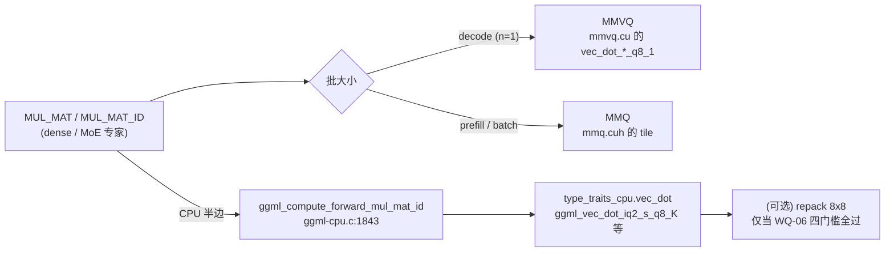

[中文](03-weight-quantization-and-kernels.md) · [English](03-weight-quantization-and-kernels.en.md)

# 03 权重与量化：格式选型、混合 dtype、反量化内核与覆盖矩阵

本章记录"权重侧"的量化选型与内核工作：为什么用这个 UD-IQ3_XXS、一个文件里到底装了什么、
IQ（码本查表）与 Q（位解包）两类反量化内核在本机同类测量里为什么差到接近一个数量级、
权重重排（repack/8x8）在本仓库到底有没有被选中、以及压缩权重字节的实测空间。

时间范围：2026-09-13 傍晚 18:09–19:26（外加 09-13 前序的 PLE/缓存背景）。本章的数字均为"同条件"
实测；凡跨节、跨配置的数字都单独标注口径，不做直接排优。

- 上一章：[host/devpart](01-host-and-devpart.md)　预测与缓存：[02](02-prediction-and-cache.md)
- 下一章：[KV/TBQ/NXQ](04-kv-tbq-and-nxq.md)　正确性与方法：[05](05-correctness-and-methodology.md)
- 索引：[README](README.md)　历史来源快照：[sources/](sources/)

---

## 0. 本章边界：什么算"权重"，什么不算

| 属于本章 | 不属于本章（去 04 章） |
|---|---|
| GGUF 张量类型（`iq2_s` / `iq4_nl` / `iq3_s` / `q6_K` / `q8_0` / `f32` / `bf16`） | KV cache 类型（`f16` / `q8_0` / `q4_0` / **`tbq3_0` / `tbq4_0`** / `nxq2_0` / `nxq3_0`） |
| 权重反量化 / `vec_dot` / repack / MMVQ / MMQ / `MUL_MAT` / `MUL_MAT_ID` | `FLASH_ATTN_EXT` 的 K/V 格式、FA 白名单、KV 量化质量（PPL/KLD） |
| 权重字节（bpw、每专家字节、预取字节） | KV 字节 → MoE 缓存槽数、256k 场景缓存归零 |

**易混点（重要）**：`tbq3_0` / `tbq4_0` / `nxq*_0` **不是权重格式**，它们是 KV cache 的量化类型，
属于 KV 侧测试。原始记录见 `sources/handoff.md` §6.29（快照行 994–1018）、§6.42（快照行 1475–1504）、
§6.43–6.45（快照行 1505–1714）；本章只记录其与权重侧的交叉点（内核覆盖、FA 白名单），
完整结论见 [04-kv-tbq-and-nxq.md](04-kv-tbq-and-nxq.md)。
本章用 `TQ`/`TBQ` 指代 KV 侧的 TurboQuant 类型时一律加"KV"限定词，避免与权重 IQ 混同。

---

## 1. 证据等级、状态标签与行文约定

### 1.1 状态标签（全章统一）

| 标签 | 含义 |
|---|---|
| **已发布** | 该提交是发布分支原生代码基线 `7e01451b2` 或更早的祖先（`7e01451b2` 已含 §6.34–6.37） |
| **仅 WIP** | 提交只存在于源工作区历史（`7e01451b2` 之后），发布分支不含这些代码 |
| **仅设计/仅分析** | 只有文档/分析，没有对应代码改动 |
| **已撤回** | 代码做过、测过，随后回退，仓库不再包含 |
| **仍开放** | 有明确后续钩子与重新开启条件 |
| **本次复测** | 2026-09-14 由本章用只读工具重新核对过的数字（非新实验） |

发布分支 `master` 当时的 HEAD 为 `0862af564`（= `7e01451b2` + 一个文档提交）；
本章引用源码位置时：存在于 `7e01451b2` 的写 `文件:行`；只存在于 WIP 的只写提交号与标识符
（不造死链）。源工作区 HEAD 为 `17ca0de85`，另有未提交改动。

### 1.2 硬件与运行环境（用户提供的机器信息）

Ryzen 9 5950X（Zen 3，无 AVX-512）、DDR4-2666 128 GB、RTX A5000 Laptop 16 GB、PCIe 4.0 ×8。
运行时 SIMD 实测（原始日志 `sched-text-err.txt` 首行）：

```
CPU : SSE3 = 1 | SSSE3 = 1 | AVX = 1 | AVX2 = 1 | F16C = 1 | FMA = 1 | LLAMAFILE = 1 | OPENMP = 1 | REPACK = 1 |
```

注意两点：① `REPACK = 1`（重排内核**已编入**）；② 同一构建的 CMakeCache 里
`GGML_AVX2:BOOL=OFF`、`GGML_AVX512:BOOL=OFF`、而 `GGML_NATIVE:BOOL=ON`
⇒ 显式开关是关的，实际走 `-march=native`（见 §6.38，快照行 1328–1370）。

### 1.3 行文约定

- 行号一律指 **`sources/` 下的快照文件**。每份快照开头都有 **11 行**归档说明
  （“历史来源快照”标题至分隔线），因此 **原始行号 = 快照行号 − 11**；本章引用 handoff 用
  §编号 +（快照行），引用其它快照用 `文件名:快照行`。需要核对原文行号时按此换算。
- **microbench ≠ 端到端**：`test-quantize-perf` 的 GB/s 只说明单核 `vec_dot` 的算子成本，
  不代表 token 时间；本章凡引用 microbench 都同时给出其在端到端里占的比重。
  （**注意**：该工具打印的 `GB/s` 实为 **GiB/s**，见 WQ-08 §9.1 的更正；与 PCIe 的十进制
  GB/s 比较前须 ×1.073 741 824。）
- **有效 GB/s 不跨格式排优劣**：`X GB/s（量化字节）` 同时受 bpw 影响，只有在同字节口径下才可比；
  有意义的换算量是"权重/秒"。详见 §13。

### 1.4 时间线（决定"已发布"还是"仅 WIP"）

| 提交 | 时间（2026-09-13） | 内容 | 状态 |
|---|---|---|---|
| `297b60792` | 18:09 | §6.34 IQ4_NL 的 AVX2 算子评估 | 已发布 |
| `7baae92dc` | 18:12 | §6.35 真实类型分布 + 6.34 更正 | 已发布 |
| `7e01451b2` | 18:19 | §6.36 混合类型寻址审计 + §6.37 压缩评估；**发布分支原生代码基线** | 已发布 |
| `8a0bb3b7f` | 18:23 | §6.38 内核覆盖矩阵 | 仅 WIP |
| `79ff52883` | 18:31 | §6.39 CPU 算子效率实测 | 仅 WIP |
| `c8a581cc0` | 18:33 | §6.40 AVX2 repack 边界与收益（纯分析，无代码） | 仅 WIP |
| `4aaef90b9` | 18:39 | §6.41 两个 AVX2 实验（代码已回退） | 实验代码**已撤回** |
| `0d3d6c9d9` | 19:26 | iq4_xs 8x8 repack（**未写进 §6.41 正文**） | 仅 WIP、**仍开放** |

> 叙事位置：权重/内核这条线**不是**本项目的起点。项目第一条线是 PLE 缓存（见
> [00 研发时序](00-research-chronology.md) 与 [02](02-prediction-and-cache.md)），
> 本章的入口问题恰恰来自 PLE 侧："仓库里那套 IQ4_NL AVX2 dot/repack 算子，能不能帮到 MoE 缓存？"。
> 因此本章所有结论都是"旁路收益评估"，不要当作主线起点。

---

## 2. WQ-01：为什么是这个量化（UD-IQ3_XXS）——选型与标签陷阱

| 字段 | 内容 |
|---|---|
| **路线 ID** | WQ-01 |
| **状态/版本** | 已发布（事实基线；`7e01451b2` 含对其标签的更正） |
| **为何尝试** | 模型由**外部既定量化**（unsloth 的 UD 动态量化配方），文件名标称 `IQ3_XXS`、`ftype` 报 `IQ3_XXS - 3.0625 bpw`。项目设定是：**128 GB 主存 + 16 GB GPU 的部分 offload 路径**，同时要留出 256k KV 与 MoE 专家缓存的空间。**这不是一次选型实验**——本项目没有做过严格的配方横评（质量/体积/速度三者对比） |
| **技术机制** | 标称 3.0625 bpw 的"UD（dynamic，动态量化）"配方：一个文件里按张量敏感度混用多种类型；`ftype`/文件名只反映**配方名**，不反映任何单个张量的真实类型 |
| **实验条件与证据** | 模型 `Qwen3.8-Flash-Next-UD-IQ3_XXS-0000{1,2,3}-of-00003.gguf`（10.9 MB + 46.16 GiB + 30.16 GiB；共 1224 张量、合计 76.31 GiB 权重）。运行时 `ftype` 行见任意 `*-out.txt`（例：`t-auto-out.txt`、`guard-1-out.txt` 头部）。类型分布见 WQ-02 |
| **观察与结论边界** | 工程早期文档把 `IQ3_XXS` 当作"权重类型"写进了边界假设：`sources/moe-decode-perf-plan.md` 第 41 行、`sources/rebuild-spec.md` 第 53 行把"IQ3_XXS 反量化与 GEMM kernel"列为固定不改的一块；`sources/rebuild-spec.md` 第 193 行写"量化类型不变、张量形状不变"。**在不知情的前提下这是合理的**——真正需要更正的只是"我们的专家权重是 IQ3_XXS"这个事实本身（§6.34 → §6.35 更正） |
| **保留/放弃理由** | 保留：换量化 = 整个模型重新量化，质量会变，属于模型配方决策而非工程优化 |
| **遗留问题 / 重新开启条件** | 若要动配方：需要一个 `down=iq2_s/iq3_s` 的 UD 变体才能实测收益与质量代价（§6.37 结论 4） |

**边界**：本章没有"我们为什么选 UD 而不是别的配方"的一手记录。原始的选型对比（质量/大小）
不在本工作区内，**也没有做过**。可确证的只有：① 模型是外部给定的 GGUF；
② 项目运行在 76.31 GiB 权重 + 128 GB 主存 + 16 GB GPU 的**部分 offload** 形态上
（加载表见 WQ-06 §7.2：CUDA0 3.8 GiB / CUDA_Host 45.8 GiB / CPU_Mapped 26.8 GiB，
**并不是"整模型塞进 GPU"**）；③ 由此产生的工程后果是"标签会误导决策"。
凡引用"选型原因"，只能引用到这三条，不能写成"按某项指标筛出的最优配方"。

---

## 3. WQ-02：真实混合 dtype 分布与字节账

| 字段 | 内容 |
|---|---|
| **路线 ID** | WQ-02 |
| **状态/版本** | 已发布（§6.35，快照行 1236–1269，提交 `7baae92dc`）+ **本次复测**（2026-09-14） |
| **为何尝试** | §6.34 的结论建立在"我们的专家是 IQ3_XXS"这一错误前提上；要判断任何算子/装配决策，必须先知道真实的每张量类型 |
| **技术机制** | 读 GGUF **头部**（不读张量数据）统计类型直方图与每张量字节；`tools-gguf-types.py` |
| **实验条件与证据** | 三个分片 + `tools-gguf-types.py <shard>`；几何自检 `tools-gguf-types.py <shard> --check` |

### 3.1 类型直方图（本章 2026-09-14 复测，只读文件头）

| 类型 | 张量数 | 字节 | 占比 |
|---|---|---|---|
| **`iq4_nl`** | 49 | **47.91 GiB** | 62.8% |
| **`iq2_s`** | 94 | 23.52 GiB | 30.8% |
| `q6_K` | 250 | 3.10 GiB | 4.1% |
| `q8_0` | 248 | 0.79 GiB | 1.0% |
| `iq3_s` | 2 | 0.67 GiB | 0.9% |
| `f32` | 557 | 0.29 GiB | 0.4% |
| `bf16` | 24 | 0.03 GiB | 0.04% |
| **合计** | **1224** | **76.31 GiB** | 100% |

与 §6.35 的历史表一致的点：`iq4_nl` 49 张量 / 47.9 GiB / 63%、`iq2_s` 94 / 23.5 GiB / 31%、
`q6_K` 250 / 3.1 GiB / 4%、`q8_0` 248 / 0.8 GiB / 1%。
**仅"其它"合并行略有出入**：历史表写 `f32/bf16/iq3_s = 560 张量 / 1.2 GiB / 1%`，
本次复测为 583 张量 / 0.99 GiB / 1.3%（`f32` 557、`bf16` 24、`iq3_s` 2）。
差异只落在这一合并行，且不改变任何结论；引用时以本节复测值为准，并保留历史值以便追溯。

⇒ 文件名里的 **`IQ3_XXS` 不是任何一个张量的类型**（是配方名），**`iq4_nl` 才是最大头**。
`ftype` 行报的 `IQ3_XXS - 3.0625 bpw` 因此是一条会误导内核与装配决策的元数据。

### 3.2 专家张量的真实几何与字节

| 张量 | 类型 | 每张量 | `ne` | 张量数 |
|---|---|---|---|---|
| `blk.N.ffn_gate_exps.weight` | `iq2_s`（仅 blk.2 为 `iq3_s`） | 256.25 MiB（blk.2：343.75 MiB） | `[2560, 640, 512]` | 47（+1） |
| `blk.N.ffn_up_exps.weight` | `iq2_s`（仅 blk.2 为 `iq3_s`） | 256.25 MiB（blk.2：343.75 MiB） | `[2560, 640, 512]` | 47（+1） |
| `blk.N.ffn_down_exps.weight` | **`iq4_nl`** | **450.00 MiB** | `[640, 2560, 512]` | 48 |

（合计 144 个专家张量 = 47 + 1 与 47 + 1 的 gate/up，再加 48 个 down；
`iq2_s` 总计 94、`iq3_s` 2 —— 与 3.1 的类型直方图自洽。
另一处自洽：`iq4_nl` 共 49 张量 = 48 个 down + `per_layer_token_embd`。）

- 每专家字节 = 524 800（gate）+ 524 800（up）+ 921 600（down）= **1 971 200 B = 1.88 MiB**；
  其中 **down 占 46.8%**（配方决定，与准入策略无关）。
- 模型元数据（`sched-text-err.txt`）：`n_expert = 512`、`n_expert_used = 10`。
- **PLE 表**：`per_layer_token_embd.weight` = `iq4_nl` = **27 465.95 MiB（26.82 GiB）**，单张量。
  这正是 CPU 侧 `CPU_Mapped` 缓冲的 27 465.95 MiB（见 WQ-06 的加载表）——即那条
  "PLE 缓存该用它"的 IQ4_NL 路径（§6.35）。

### 3.3 字节账与两个不同口径的数字

以 48 层、`n_expert_used = 10` 计（本章复算）：

- 一层一层专家全集 = 19.71 MB（1.88 MiB × 10）；
- 每 token 专家全集 ≈ **901.9 MiB/token**；
- 命中 80% 时真实漏命中 ≈ **180 MiB/token**（与 §6.39 的"~180 MB/token"一致）；
- **准入每多放开一个排名 ≈ 每层多 1 个专家 ≈ 48 × 1.88 MiB = 90.2 MiB/token**
  ——与 §6.35 的"合计 92.5–103.8 MB/token"（配 gate 26.6% / up 26.6% / down 46.8% 的比例）
  以及 §6.6 实测的"每档 ≈100MB/token"吻合。

- **不要混用的两个数**：§6.35 的 92.5–103.8 MB/token 是**每档（每多一个准入排名）的边际字节**；
  §6.39 的 `pre ≈ 630 MB/token` 是**用边际 0.073 ms/MB 反推的总预取字节**。
  **算术更正**：`49.3 ms ÷ 0.073 ms/MB = 675 MB`，不是 630 MB——手记的 630 无法由该除法复现，
  本章保留历史值 630 以便追溯，同时给出复算值 675。两者**都不是 DMA 实测**：
  §6.6 直接测得的 161 / 254 / 464 MB/tok（命中 40.2 / 46.9 / 58.2%）才是预取量的原始证据，
  且其边际本身随量走高（0.073 → ~0.09 ms/MB），所以用常数边际外推只是量级估计。
  该量级估计的用途仅是"CPU 内核不是瓶颈"（见 WQ-08），不作验收数字。

### 3.4 结论边界

- 字节分布**只对这一个 GGUF**成立；换任何一个 UD 变体（例如 down 换 `iq2_s`）都要重测。
- `--check` 只验证几何（见 WQ-03），**不验证数值质量**。
- 复测工具只读文件头：不加载模型、不读张量数据，因此可以安全地反复核对。

---

## 4. WQ-03：混合类型（UD）下的寻址审计与运行期保险

| 字段 | 内容 |
|---|---|
| **路线 ID** | WQ-03 |
| **状态/版本** | 已发布（§6.36，快照行 1270–1296，提交 `7e01451b2`） |
| **为何尝试** | 缓存按"行/专家偏移"寻址，而 `iq2_s` / `iq4_nl` / `iq3_s` 的块几何完全不同（256/82、32/18、256/110）。任何把行大小当常量的地方都会**静默错位**——这是 UD 量化的新风险，必须审计 |
| **技术机制** | 逐张量几何：每专家字节取**该张量自己的** `nb[2]`；块字节取**该张量自己的** `ggml_type_size`；每分量起始按**自己的** `type_size` 对齐（下限 512）；slot 步长按**所有分量 `type_size` 的 LCM** 对齐，保证 `nb[2] / type_size` 整除；专家数不一致则**禁用缓存**而不继续猜 |
| **实验条件与证据** | 代码位置（均存在于 `7e01451b2`）：`ggml/src/ggml-backend.cpp:3107`（`expert_size = input->nb[2]`）、`:3108`（`type_size`）、`:3209-3212`（注释与 `bundle_alignment`）、`:3215`（专家数不一致 → 禁用）、`:3220`（按 `max(type_size,512)` 对齐）、`:3223-3232`（LCM → `bundle_stride`）。原注释即写明理由："512 alone is not divisible by e.g. IQ3_XXS' 82"。全文无硬编码类型常量 |
| **观察与结论边界** | 本模型实测核对：gate/up `iq2_s` 820 B/行 × 640 = 524 800 B，`% 82 == 0`；down `iq4_nl` 360 B/行 × 2560 = 921 600 B，`% 18 == 0`。几何自检（本次复测，分片 2/3）：**PASS（468 + 756 = 1224 张量）**，与 §6.36 记录的 1224 全 PASS 一致 |
| **保留/放弃理由** | 保留。这是"未来换量化时把静默错位变成明确报错"的保险；本模型跑 256 token 无误报，`slots = 97` 正常 |

**槽几何复算（2026-09-14，按 `7e01451b2` 的 `moe_cache_component_stride`/LCM 代码逐步重算）**

| 层形状 | 分量（顺序） | payload（三张量 `expert_size` 之和） | bundle stride | 对齐浪费 |
|---|---|---|---|---|
| 常规层（gate/up `iq2_s` + down `iq4_nl`） | 524 800 + 524 800 + 921 600 | **1 971 200 B** | **2 078 208 B = 11 × 188 928**（`lcm(512,82,18)`） | **107 008 B** |
| blk.2（gate/up `iq3_s` + down `iq4_nl`） | 704 000 + 704 000 + 921 600 | 2 329 600 B | **2 534 400 B = 10 × 253 440**（`lcm(512,110,18)`） | 204 800 B |

- **更正手记的算术错误**：§6.36 写"对齐浪费 9728 B = 0.47%"。按同一组数字，
  `2 078 208 − 1 971 200 = 107 008 B`；`9 728 = 107 008 / 11`，即手记少算了一个数量级。
  正确的相对量是 **对 payload 5.43%、占 stride 5.15%**（常规层）。
- 复算依据（可重跑）：`moe_cache_component_stride()` = `expert_size + ceil(512/type_size)*type_size`
  （`ggml/src/ggml-backend.cpp:2931-2934`）；分量起点 = `align_up(offset, max(type_size,512))`（`:3220`）；
  `bundle_stride` = `align_up(结束偏移, lcm(所有分量 type_size))`（`:3223-3232`）。
- 由此也能解释另一处的数字来源：`sources/moe-cache-score-aware-prd.md` 第 40 行的
  "共享池 pitch 2 534 400 字节不能被 82 字节量化块整除"—— **2 534 400 正是 blk.2 这一层的 stride**
  （`2 534 400 % 82 = 26`，而常规层 `2 078 208 % 82 = 0`）。该文本属于**较晚的共享池（全局单 pitch）
  策略**设计（WIP 文档），**不是本章时间线上更早的问题，也不能说已由逐层 LCM 解决**；
  它属缓存策略范畴，主述在 [02 章](02-prediction-and-cache.md)，本章只记录这个数值对应关系。

| **遗留问题 / 重新开启条件** | **换配方/换 arch 时必须重跑 `--check`**（PASS 是必要条件，不是充分条件：它只覆盖"每张量的 `expert_size` 是块字节整数倍"，不覆盖"每层的 stride 对其分量块大小整除"——后者由 LCM 保证，但一旦引入跨层共享的单一 stride（如上表的全局 pitch），该保证就可能失效） |

---

## 5. WQ-04：缓存压缩空间评估（结论：基本没有）

| 字段 | 内容 |
|---|---|
| **路线 ID** | WQ-04 |
| **状态/版本** | 已发布（§6.37，快照行 1297–1327，提交 `7e01451b2`；仅历史报告，**未在本工作区定位到原始日志**） |
| **为何尝试** | 预取字节是瓶颈（§6.6），最直接的想法是"压缩要搬的权重字节" |
| **技术机制** | ① 对 GGUF 张量原始字节做无损压缩（zlib -9 / lzma，前 4 MiB 样本）；② 分析块结构里"元数据"（scale 等）占比；③ 缓存自身布局浪费；④ 换更低 bpw 的格式 |
| **实验条件与证据** | 见下表（§6.37） |

无损压缩实测（前 4 MiB 原始字节）：

| 张量 | 格式 | zlib -9 | lzma |
|---|---|---|---|
| `blk.0.ffn_down_exps` | `iq4_nl` | **98.3%** | 98.9% |
| `blk.0.ffn_gate_exps` | `iq2_s` | **99.8%** | 100.0% |

⇒ 在该样本上，量化权重的无损压缩收益 **不足 2%**（两份张量 98.3% / 99.8%），
即"连 11–12% 的 fp16 `d`/`scales` 字段也没被压掉"是**这个样本、这种方法**下的观察，
不能推广成"任何压缩/任何编码都无空间"。

"缩元数据"的算术（`ggml-common.h` 块结构，QK_K = 256 / QK4_NL = 32）：

| 张量 | 格式 | 块 | 元数据 | 占比 | 现成替代 | 折算到总预取字节 |
|---|---|---|---|---|---|---|
| gate/up | `iq2_s` | 82 B | d2 + scales8 = 10 B | 12.2% | `iq2_xxs`（−9.8%） | −5.2% |
| down | `iq4_nl` | 18 B | d2 | 11.1% | **`iq4_xs`（−5.6%）** | **−2.6%** |
| blk.2 gate/up | `iq3_s` | 110 B | 6 B | 5.5% | — | — |

- 缓存自身布局浪费 **5.15%**（WQ-03 复算：常规层 stride 2 078 208 B vs payload 1 971 200 B
  ⇒ 107 008 B；手记的 0.47% 是算术错误）。这一项**比手记大得多**，且**布局开销能否回收、
  代价多少本轮并未验证**——不能用原来那个算错的 0.47% 来排除它。
- 43 ms 的预取只会降到 ~41.9 / ~40.8 ms ⇒ **不值**。

**在已评估的这几类压缩里，只有"降 bpw"显示出两位数百分比的字节杠杆**（§6.37 结论 4）——
注意它是模型配方决策，不是工程优化：

| 动作 | 字节效应 | 副作用 |
|---|---|---|
| down 从 `iq4_nl`（4.5 bpw，占预取 46.8%）换成 `iq2_s`（2.5625 bpw） | 总预取字节 **−20%**（43 → 34 ms，[INFERENCE] +2 t/s 量级） | 每 slot 小 20% ⇒ 97 → ~121 槽，命中再上一档；但**模型质量会变**，属配方决策 |

**边界的边界（前提条件）**：如果目的是省 *PCIe 字节*，压缩必须由 **GPU 直接解压**才有意义
（否则解压后仍要整体传输）；如果目的是省 *VRAM*（更多槽），**本次分析得到的降字节候选是降低 bpw**
（如上表）——布局开销（5.15%）能否回收及其代价**本轮未验证**，所以这里不写成"唯一途径"。
本节**没有**做 GPU 解压的原型，也没有测过任何"压缩后再传"的端到端场景。

- 遗留 / 重新开启：需要一个 `down=iq2_s/iq3_s` 的 UD 变体才能测真实（速度 + 质量）收益。

---

## 6. WQ-05：第一次评估——IQ4_NL 的 AVX2 dot/repack 算子对本模型有没有用

| 字段 | 内容 |
|---|---|
| **路线 ID** | WQ-05 |
| **状态/版本** | 已发布（§6.34，快照行 1201–1235，提交 `297b60792`；**结论保留，论据被两次更正**） |
| **为何尝试** | 仓库里已有一套"现成的"4-bit 重排加速算子；若能用上，就是把 CPU 半边的 dot 免费提速——这是本条线最初的动机 |
| **技术机制** | `ggml/src/ggml-cpu/repack.cpp` 里的 `iq4_nl_4x4/8x8/16x1` gemv/gemm（`block_iq4_nlx4/x8/x16`）+ `arch/x86/repack.cpp` 的 AVX2 实现（`vpshufb` 查表）；入口断言 `GGML_ASSERT(t->type == GGML_TYPE_IQ4_NL)` 限定了只对 IQ4_NL 张量生效 |
| **实验条件与证据** | 代码位置（`7e01451b2`）：`ggml/src/ggml-cpu/repack.cpp:3602/3659/3716`（三处断言）、`:4558`（`iq4_nl_8x8_q8_0` traits）、`:4670-4676`（AVX2 分支）。单核 `test-quantize-perf --op vec_dot_q`：工具显示 `iq4_nl` **12.62**、`q4_0` **11.70**、`q8_0` **32.00**（§6.34；**未保存原始日志，仅历史报告**）。**单位同 WQ-08 §9.1 的更正**：该工具显示值实为 GiB/s ⇒ 十进制为 **13.55 / 12.56 / 34.36 GB/s** |
| **观察与结论边界** | ① 在一次被 instrument 的解码图里（total 55.4 ms），**计时窗口内** CPU 半边只有 0.7 ms（≈1.3%）。这是**窗口内占比**，不是严格的关键路径上限：该计时器各项本就互相重叠（手记原表自带"有重叠"标注），且异步重叠意味着"所有 dot 成本都在这 0.7 ms 内"**无法由该数据证明**——因此 1.3% 只能读作"在这一次测量的记账方式下，CPU 半边是小数项"；② 换格式会让真正的墙更糟：`iq4_nl` 4.5 bpw vs 文件名标称的 `IQ3_XXS` ≈3.06 bpw ⇒ 每字节多 47%，而墙是预取 PCIe 争用（§6.6 实测边际 0.073 ms/MB ≈ 13.8 GB/s，十进制）；③ 按更正后的单位，"dot 有富余"仍然成立：`iq4_nl` 13.55 GB/s、`q8_0` 34.36 GB/s（十进制）vs PCIe 供给约 5 GB/s（十进制）⇒ 约 2.7× 富余 |
| **保留/放弃理由** | **放弃（对 MoE）**：不是"算子不好"，而是在该计时口径下 CPU 半边是小数项，且换格式会加重预取。**不要**把 microbench 的加速比当成 token 收益 |
| **遗留问题 / 重新开启条件** | 该算子与 `per_layer_token_embd`（26.8 GiB、`iq4_nl`）之间的关联记于 §6.35，但那只是"用途同源"，**不等于"打开 PLE 缓存就能用上重排"**。真正的前提是 WQ-06 列出的三条同时满足（格式在支持集合内 / 张量落在 repack 缓冲 / 图内算子是 `MUL_MAT`(2D) 或 `MUL_MAT_ID`(3D)）。本模型当前不满足第三条。**把 PLE 的取行人为改成 GEMM 不是本项目的既定方向**，本章不建议 |

**§6.34 表：单次解码图分解（55.4 ms）**

> 口径：`MOE-CACHE` 计时器按解码图打印，**各项互相重叠**（原表即注明"有重叠"，故占比合计 >100%）。
> 下表的"占比"是**窗口内份额**，不是关键路径的严格分解。

| 阶段 | 时间 | 占比 |
|---|---|---|
| 预取（专家权重 H2D / 缓存填充） | **43 ms** | **78%** |
| `ids_wait`（每层路由 ids 回读的往返延迟） | **17.8 ms** | **32%**（与上文有重叠，故合计 >100%） |
| GPU 入队 | 7.6 ms | 14% |
| 分区 | 2.7 ms | 5% |
| **CPU 半边（计时器口径）** | **0.7 ms** | **1.3%** |

原表在此处标注"（所有 dot 都在这里）"。本章不把它当已证事实：该计时项统计的是
CPU 半边在窗口内的时间，**不能证明**其它项（如 `pre`、`smoe`）里没有并行的 dot 工作。

原始日志：与该分解同格式的实测行可在 `c1-3-err.txt` 找到一条完全同量级样本——
`total=55.4 ms | ids_wait=18.1 ms partition=2.71 ms cpu=0.7 ms gpu_queue=7.8 ms pre=43.2 ms
mrs=0.40 ms prefetch_submit=1.51 ms smoe=0.73 ms`（同一形态也出现在 `f-a3-err.txt`、
`hd-nb3-a-err.txt`、`t-def-err.txt`）。
**边界**：本章无法把 §6.34 表里的每一格一一对应到某一次特定运行（表值是该类样本的整理值，
四舍五入到一位小数）；引用的这四条日志是**同类同口径样本**，不是"§6.34 就是这一次"的证明。

---

## 7. WQ-06：权重重排（repack / 8x8）到底有没有被选中

| 字段 | 内容 |
|---|---|
| **路线 ID** | WQ-06 |
| **状态/版本** | 混合：机制**已发布**（`7e01451b2` 的代码路径），"零分配"的实测证据来自 `8a/79ff` 之后的 WIP 批次（日志已存） |
| **为何尝试** | §6.34 把原因写成"格式不匹配"，§6.35 改成"repack buft 从未被选中但理由是源码里没有 repack 字样"，§6.41 又更正"机制是泛型的"。三次说法必须收敛成一条可验证的链路 |
| **技术机制** | 四条独立的门槛，缺一不可（见下） |
| **实验条件与证据** | 源码（`7e01451b2`）+ 加载日志（`sched-text-err.txt`） |

### 7.1 链路（每一步都可查）

```
① 注册   ggml-cpu.cpp:42-66  ggml_backend_cpu_get_extra_buffer_types() 含 ggml_backend_cpu_repack_buffer_type()
         ggml-cpu.cpp:76-86  暴露给 ggml_backend_dev_get_extra_bufts
② 入选   llama-model.cpp:1068-1078  make_cpu_buft_list() 把 extra bufts 放进 CPU 候选表
③ 选型   llama-model-loader.cpp:1060-1071  select_weight_buft() 取第一个"支持"的 buft
         llama-model-loader.cpp:920-1054  weight_buft_supported(): 用候选 buft 造一个 dummy 缓冲，
                                         再问 ggml_backend_dev_supports_op(dev, op_tensor)
④ 判定   ggml-cpu.cpp:424-438  CPU supports_op 检测到 extra buft 时转交 buf_extra->supports_op()
         repack.cpp:4781-4814  repack 的 supports_op()：仅接受
                                 op == MUL_MAT    且 src0 是 2 维  且 src0 已在 repack 缓冲
                                                 且 get_optimal_repack_type(src0) != nullptr
                             或 op == MUL_MAT_ID 且 src0 是 3 维（同上）
                               （src1 必须在 host、且类型为 F32）
```

### 7.2 实测证据：注册了，但零分配

`sched-text-err.txt` 的加载表（`--verbose`）：

```
load_tensors:        CUDA0 model buffer size =  3816.16 MiB
load_tensors:    CUDA_Host model buffer size = 46872.31 MiB   ← MoE 专家（45.8 GiB）
load_tensors:   CPU_Mapped model buffer size = 27465.95 MiB   ← per_layer_token_embd（26.8 GiB, iq4_nl）
```

**没有任何 `CPU_REPACK ... model buffer size` 行** ⇒ 重排缓冲注册了、但零分配。

### 7.3 为什么本模型一定选不上（本章新增的机制结论）

- **MoE 专家**（`iq2_s`/`iq4_nl`/`iq3_s`，144 个张量）被钉在 **CUDA_Host** 大缓冲（45.8 GiB，
  为 SMoE 缓存服务）⇒ 它们不在 CPU 候选表里，**CPU repack 从结构上不可能作用到它们**。
- **CPU 侧唯一的大量化张量**是 `per_layer_token_embd`（26.8 GiB，`iq4_nl`），它落在
  `CPU_Mapped`。它的图内算子是 **`GET_ROWS`**（§6.38 的调度扫描：CPU 上只有
  `MOE_CPU` / `GET_ROWS` / blk.47 的未融合 `MUL_MAT_ID`+`SWIGLU`）——
  而 repack 的 `supports_op` 只认 `MUL_MAT` / `MUL_MAT_ID`（repack.cpp:4783、:4800）
  ⇒ `GET_ROWS` 直接落空，重排不适用。
- 其次，静态类型 id 也说明了重排类型**不进文件格式**：`ggml.h:421-428` 里
  `GGML_TYPE_IQ4_NL_4_4/4_8/8_8` 已注释为历史 id，`ggml.c:944-957` 的 36/37/38 条目写的是
  `"... REMOVED, use IQ4_NL with runtime repacking"` ⇒ 重排是**运行期**行为，与 GGUF 里的类型无关。

**结论**：`§6.34` 的结论（对本模型 MoE 没有帮助）成立；`§6.35` 的"从未被选中"成立；
`§6.41` 对**理由**的更正也成立（机制是泛型的，源码里不出现 `repack` 字样）。
两次更正都不是"结论翻转"，而是论据逐步收敛到 §7.3 这条可查链路。

- 遗留 / 重新开启条件：**三条同时满足**——① 该张量类型在 `ggml_repack_get_optimal_repack_type()`
  的支持集合内（x86 AVX2 目前只有 `IQ4_NL`，且需 `ne[1] % 8 == 0`）；② 该张量被分配到
  repack 缓冲（而不是 CUDA_Host / `CPU_Mapped`）；③ 图内算子是 `MUL_MAT`（2 维权重）或
  `MUL_MAT_ID`（3 维权重）（`repack.cpp:4781-4814`）。本模型当前：**专家张量不满足②**
  （在 CUDA_Host 缓冲里），**PLE 不满足③**（图内算子是 `GET_ROWS`）。
  三条不同时成立时，重排代码在本模型上始终是闲置的。

---

## 8. WQ-07：内核覆盖矩阵（格式 × 计算路径 × 后端）

| 字段 | 内容 |
|---|---|
| **路线 ID** | WQ-07 |
| **状态/版本** | 仅 WIP（§6.38，快照行 1328–1370，提交 `8a0bb3b7f`；发布基线不含本节文档，但其引用的内核覆盖在 `7e01451b2` 即已存在） |
| **为何尝试** | 要排除"某条路径退化成 f16/cuBLAS 或裸回落"这一整类解释 |
| **技术机制** | 逐后端读 dispatch 表 + 调度实测 |
| **实验条件与证据** | 源码位置 + `GGML_SCHED_DEBUG=2` 扫描（`tools-op-backend-scan.py`，原始日志 `sched-text-err.txt`、`sched-vis-err.txt`） |

### 8.1 覆盖表

| 类型 | CPU `vec_dot`（激活量化） | CUDA 解码 MMVQ | CUDA 预填 MMQ | 用在 |
|---|---|---|---|---|
| `IQ2_S` | `ggml_vec_dot_iq2_s_q8_K`（Q8_K） | `vec_dot_iq2_s_q8_1` | 有 case + tile | MoE gate/up（94 张量） |
| `IQ3_S` | `ggml_vec_dot_iq3_s_q8_K`（Q8_K） | `vec_dot_iq3_s_q8_1` | 有 | MoE gate/up（blk.2） |
| `IQ4_NL` | `ggml_vec_dot_iq4_nl_q8_0`（Q8_0） | `vec_dot_iq4_nl_q8_1` | 有 | MoE down（48）、PLE |
| `Q6_K` | `ggml_vec_dot_q6_K_q8_K`（Q8_K） | `vec_dot_q6_K_q8_1` | 有 | 注意力、部分权重 |
| `Q8_0` | `ggml_vec_dot_q8_0_q8_0`（Q8_0） | `vec_dot_q8_0_q8_1` | 有 | 嵌入/部分权重 |

代码位置（`7e01451b2`）：CPU 侧 `ggml/src/ggml-cpu/ggml-cpu.c:369`（IQ3_S）、`:375`（IQ2_S）、
`:393`（IQ4_NL）、以及 Q6_K/Q8_0 的对应条目；激活量化类型见各条目的 `vec_dot_type`。
CUDA 解码 `ggml/src/ggml-cuda/mmvq.cu:29/33/35`（外加 `get_vdr_mmvq()` 的向量化参数）；
预填 `ggml/src/ggml-cuda/mmq.cuh:88/90/95`（DS 布局）、`:410/412/415`（tx 配置）、
`:1589/1591/1592`（`DECL_MMQ_CASE`）。
⇒ **两边都有加速算子，没有"裸回落"**；解码路径也不存在退化成 f16/cuBLAS 的分支。

### 8.2 调用链（权重侧）



- FA（`FLASH_ATTN_EXT`）**不在权重链路上**：它的类型参数是 K/V cache 类型（`f16`、`q8_0`、`q4_0`、
  `tbq4_0` 等），属 KV 侧 → [04 章](04-kv-tbq-and-nxq.md)。本章只在"覆盖矩阵"里记录它的存在
  （`ggml/src/ggml-cuda/ggml-cuda.cu:2385/5564`），不对其行为下结论。

### 8.3 调度实测（原始日志，2026-09-14 复跑扫描脚本）

| 日志 | 解析节点 | CUDA0 | CPU | CPU 占比 | CPU 上的算子 |
|---|---|---|---|---|---|
| `sched-vis-err.txt`（含视觉） | 97 726 | **97 228** | **498** | 0.5% | `MOE_CPU` ×438、`GET_ROWS` ×40、`MUL_MAT_ID` ×15（blk.47）、`SWIGLU` ×5 |
| `sched-text-err.txt`（纯文本） | 82 447 | 81 967 | 480 | 0.6% | 同上（`GET_ROWS` ×34、`MUL_MAT_ID` ×6、`SWIGLU` ×2） |

- §6.38 写的"97228 节点 CUDA0 / 498 CPU（0.5%）"对应 **`sched-vis-err.txt`**（本次复跑完全一致）；
  纯文本路径是另一份数字，两份都保留，不要混用。
- CPU 上只有三类：`MOE_CPU`（设计如此，`ggml/src/ggml-cuda/ggml-cuda.cu:5615` 显式 `return false`）、
  `GET_ROWS`（`token_embd` + `per_layer_token_embd`，故意留 host：张量常驻 host，省一次 D2H）、
  以及 **blk.47 的未融合 `MUL_MAT_ID`/`SWIGLU`**（最后一层没有侧图预测，`smoe_target = il + ahead < n_layer`
  的边界，故 split 未接管）。代价已计入 CPU 半边 0.7 ms，可忽略，但记为已知边界。
- 每层 4 个 split（gate/up/down 各一对 host leaf + 1 个 CPU MoE）⇒ 约 192 splits/token。
- 视觉路径：`IM2COL` ×4、`UPSCALE` ×2 全在 CUDA0；**没有出现 `POOL_*`/`WIN_*`**
  ⇒ 那些无 CUDA 的算子与本模型无关。
- **一条不成立的历史说法（本次核对的反例）**：§6.38 写"`GGML_OP_MOE_PARTITION_APPLY` 在整个源码里
  0 引用（枚举死条目）"。实际源码里**不存在这个标识符**（`GGML_OP_MOE_PARTITION_APPLY` 在两棵工作区
  全文 0 命中）。真实枚举条目是 `GGML_OP_MOE_PARTITION_IDS` / `GGML_OP_MOE_PARTITION_WGT`
  （`ggml/include/ggml.h:601-602`），且**被实际引用**（`ggml/src/ggml-backend.cpp:1365、4653`、
  `ggml/src/ggml-cuda/ggml-cuda.cu:2379/2382/5522`）。⇒ "死枚举"这一子结论**不成立**，不要照抄。

---

## 9. WQ-08：CPU 算子效率实测——"低位宽"为什么并不等于"快"

| 字段 | 内容 |
|---|---|
| **路线 ID** | WQ-08 |
| **状态/版本** | 仅 WIP（§6.39，快照行 1371–1414，提交 `79ff52883`） |
| **为何尝试** | 回答"CPU 半边能不能靠把 4n/repass 拉满来提速"，先要拿到 i-quant 的真实单核吞吐 |
| **技术机制** | `tests/test-quantize-perf.cpp` 原先对**没有 `from_float` 的类型直接跳过**，所以全部 i-quant **从来没被测过**。补丁：对这类类型改用**原始字节填充**。**该方法的有效范围有限**：原始字节填充绕过了量化路径，且不保证码本索引的命中分布、scale 的实际取值范围、数据热度与真实权重一致，也**不覆盖数值正确性**——所以这些数字应读作"在原始字节填充条件下的相对比较"，不是等价于真实权重分布的绝对值（手记称其"数据无关"，本章不沿用这一强断言）。`build-cli.bat` 增加可选 target 参数（该 helper 是 gitignore 的本地脚本） |
| **实验条件与证据** | 与 `from_float` 缺失的根因相符的代码证据：`ggml/src/ggml-cpu/ggml-cpu.c:364-366、:373` 明确注释 `from_float for iq3 and iq2_s was removed because these quants require initialization in ggml_quantize_init`，并被注释掉 ⇒ 跳过是"测试工具的盲区"，不是内核不存在 |

### 9.1 单核 `vec_dot` 实测（§6.39；**未保存原始日志，仅历史报告**）

> **单位更正（重要）**：`test-quantize-perf` 的 `gigabytes_per_second()` 实际除以 1024³，却打印
> `GB/s`（`tests/test-quantize-perf.cpp:70-72`，打印处 `:106-107`；`79ff52883` 同）⇒ 工具显示的数值
> 实为 **GiB/s**。下表**保留工具显示的原数**（列名注明），并给出按 GiB/s 正确换算的十进制字节率
> 与权重率；手记里"7.2 / 26.4 / 34 G/s"那一列是**按十进制 GB/s 误算**的结果，一并列出便于追溯。
> 与 PCIe 的十进制 GB/s 比较前必须 ×1.073 741 824。**相对速度比不受此修正影响。**

| 类型 | 2560（工具显示，GiB/s） | 65536（工具显示，GiB/s） | = 十进制 GB/s | **权重速率（G 权重/s）** | 手记值 | bpw |
|---|---|---|---|---|---|---|
| **`iq2_s`**（gate/up，53% 预取字节） | 2.13 | **2.30** | 2.47 | **7.71** | 7.2 | 2.56 |
| **`iq3_s`**（blk.2 gate/up） | 1.82 | 2.00 | 2.15 | **5.00** | 5.8（不可复现） | 3.44 |
| `iq4_nl`（down，47%） | 12.19 | 14.88 | 15.98 | **28.40** | 26.4 | 4.5 |
| `q6_K` | 16.86 | 24.93 | 26.77 | **32.63** | 30 | 6.56 |
| `q8_0` | 25.85 | **36.43** | 39.12 | **36.82** | 34 | 8.5 |
| （补充，§6.41 正文）`q2_K` | — | — | — | 48.6（手记值，无原始显示值可复核；若同口径约 52.2 [未复核]） | 48.6 | 2.625 |
| （补充，§6.41 正文）`iq4_xs` | — | 12.16 | 13.06 | **24.58** | — | **4.25**（136 B / 256 权重） |

说明：`iq3_s` 的手记值 5.8 G/s **无法由其自身列复现**（需要 0.370 B/权重，而 `iq3_s` = 110/256 =
0.4297）⇒ 正确值为 5.00 G 权重/s；`iq4_xs` 的权重速率由本章按 136/256 复算；
`iq4_nl` = 18/32 = 4.5 bpw、`iq4_xs` = 136/256 = **4.25** bpw（两者不同）。

⇒ **在本机这组样本里**：同为"低 bit"区间的 `iq2_s` 与 `q2_K` 差距约 **6.8×**
（手记口径 7.2 vs 48.6；按更正单位 `iq2_s` 为 7.71，`q2_K` 未复核）；`iq3_s` 也慢（5.00 G 权重/s），
而同族的 `iq4_nl`（4.5 bpw）有 28.40 G 权重/s。
⇒ 因此**在本机、在已测的这几个类型上**，速度主要由"码本查表 vs 位解包"决定，
而不是由位宽决定（原理见 WQ-10）；§6.39 判断它是**纯 kernel-bound**（DRAM 尚有约 10× 余量），
该判断同样只对这组测量成立。

### 9.2 但它在本次计时口径里是小数项（原始日志已存）

| 预算 | 槽 | 命中 | `cpu=` | `pre=` | total | gen |
|---|---|---|---|---|---|---|
| `auto` | 97 | 77.9–83.4%（逐层） | **1.5 ms** | 49.3 ms | 63.3 ms | 18.4 t/s |
| `4096` | 42 | 78.4–81.3%（逐层） | **1.7 ms** | 48.0 ms | 62.0 ms | 18.6 t/s |

原始日志（本次核对，与 §6.39 表逐项一致）：
`t-auto-err.txt` → `total=63.3 ms | ids_wait=4.1 | partition=2.73 | cpu=1.5 | gpu_queue=7.7 |
pre=49.3 | prefetch_submit=2.43 | smoe=17.49`，`slots= 97`；
`t-4096-err.txt` → `total=62.0 ms | ids_wait=4.2 | partition=2.50 | cpu=1.7 | gpu_queue=7.8 |
pre=48.0 | prefetch_submit=3.04 | smoe=16.98`，`slots= 42`。
**数字出入（需保留）**：§6.39 表把 gen 写成 "~20 t/s"，而两份原始日志的控制台输出分别是
**18.4** 与 **18.6 t/s**。本章以原始日志为准，不引用任何 20+ 的旧成绩。
另一处口径说明：§6.39 表里的命中率 **80.2% / 78.0%** 是整体值，上表的区间是同一批日志里
**逐层**的命中率（低层高、blk.47 最低），二者不矛盾，引用时不要互相替代。

⇒ 在该计时器口径下，CPU 半边占 **2.4–2.7%**（窗口内份额，**不是**严格的关键路径上限），
且**与槽数几乎无关**（42 vs 97 槽命中只差 2 个百分点）。
⇒ 计时窗口内的大头是主机预取路径（`pre` 项 ≈78%）。

### 9.3 关键副产物

- 缓存所需显存远少于预期：42 槽（4096 MiB）就有 78% 命中（vs 97 槽 80.2%）
  ⇒ 256k + 视觉场景不必为大缓存留显存（与 [02 章](02-prediction-and-cache.md)的准入策略互相印证）。
- `pre` 反推约 **630 MB/token（手记值）/ 675 MB/token（按 49.3 ÷ 0.073 复算）**，
  两者都只是量级估计，不是 DMA 实测（见 WQ-02 §3.3 的口径与算术更正）；
  与"真实漏命中 ≈180 MB/token"相比是 3.5× 量级 ⇒ **准入可能超额预取**。
- "内核在什么时候才值得优化"这一判断的证据强度：手记给出的是**按速率混合做的估算**
  （纯 CPU 模式 9.2 t/s、≈900 MB 专家/token、÷109 ms ≈ 8.3 GB/s），
  **没有**该模式下逐项耗时分解，因此"整个 token 就是内核速度""9.2 → ~20 t/s"
  都只能算 [INFERENCE] 推算，不能作为已验证结论；可用于说明"值得复查的方向是哪一个"。

---

## 10. WQ-09：AVX2 repack 的可行性边界与"做完值多少"

| 字段 | 内容 |
|---|---|
| **路线 ID** | WQ-09 |
| **状态/版本** | 仅 WIP、**仅分析**（§6.40，快照行 1415–1440，提交 `c8a581cc0`；无代码改动） |
| **为何尝试** | 在动手写内核之前先问：AVX2 上到底能给 i-quant 什么，以及做完值多少 |
| **技术机制** | 读源码确定模板覆盖；按已测数据推算收益 |
| **实验条件与证据** | 源码位置见下 |

AVX2 重排的真实覆盖（读源码所得，均存在于 `7e01451b2`）：

- `ggml/src/ggml-cpu/arch/x86/repack.cpp:522-523` 的
  `gemv_q4_b32_8x8_q8_0_lut_avx<block_tx8>`（gemm 版在 `:637-646`）是**真 SIMD**（AVX2 `vpshufb` LUT），
  但被 `static_assert` 限定为 `block_q4_0x8` / `block_iq4_nlx8` / `block_mxfp4x8`
  ⇒ **只适用于"4-bit + 16 项 LUT"的类型**（实例化于 `:1455`、`:1692`、`:1705`）。
- `ggml/src/ggml-cpu/repack.cpp:4670-4676`：`IQ4_NL` 在 AVX2 上有 `iq4_nl_8x8_q8_0`（需 `ne[1] % 8 == 0`）；
  `:4635`：`Q2_K` 走 **AVX512**；`:4659-4671`：`Q5_K`/`Q6_K` **仅 NEON**。
- **`iq2_s` / `iq3_s` 在 AVX2 上完全没有 repack**，且其算法是 2/3-bit grid-LUT + Q8_K bsums，
  **不能套用上述模板** ⇒ 要做就是从零写新内核（数天量级 + 正确性风险）。
- 本机是 Zen 3，**没有 AVX-512** ⇒ 所有 AVX512-only 的重排路径不可达。
- 工具盲区：`test-backend-ops` 不含 repack 类型，`test-quantize-perf` 也无法直接调 gemv-8x8
  （`nr` 语义不同）⇒ **repack 的加速比只能在"CPU 半边真正读上重排缓冲"之后实测**（而按 WQ-06，
  本模型根本选不中重排缓冲）。

**做完值多少（按已测数据推算）**

| 场景 | 现状 | 内核变快之后 |
|---|---|---|
| 有缓存（97 或 42 槽） | `cpu = 1.5–1.7 ms / 63.3 ms` = **2.4–2.7%（窗口内）** | 若内核 3×，该项只剩 1/3，即**最多消去窗口时间的 ~1.7%**；这**不等于 token 时间减少 1.7%**（其它项与异步重叠未消除，且没有端到端实测）。故结论仍是"**先不做**"，但依据是"占比小且重叠未知"，不是"已证明收益上限 2.5%" |
| 纯 CPU / 缓存关（9.2 t/s） | 手记估算 ≈900 MB 专家/token ÷ 109 ms ≈ 8.3 GB/s（十进制；`iq2_s` 2.3 与 `iq4_nl` 15 的混合——注意那两个原值是工具的 GiB/s 显示值） | 手记给 **9.2 → ~20 t/s**（[INFERENCE]，无可用的逐项分解支撑）。这一格只能说明**该模式下内核是值得复查的主要成本项**，不能作为已验证结论 |

- 另外：即便内核快 3×，`iq2_s` 也只有 2.30 GiB/s × 3 = 6.9 GiB/s = **7.41 GB/s（十进制）**
  < 预取等效 13.8 GB/s（十进制）⇒ **仍不足以翻转**"字节是瓶颈"这条判断（需要约 6×）。
  注意原手记写成"~7 GB/s vs 13.8 GB/s"时混用了两种字节定义（工具 GiB/s 与 ms/MB 的十进制 GB/s），
  结论不变但比较轴须统一。
- 结论：**不做**（在当前默认配置下）。优先级建议是非内核的：收紧准入 + 并行化预取拷贝。

---

## 11. WQ-10：两个 AVX2 i-quant 实验（做过、测过、**已撤回**）

| 字段 | 内容 |
|---|---|
| **路线 ID** | WQ-10（含实验 A 与实验 B，合并成表） |
| **状态/版本** | **已撤回**（§6.41，快照行 1441–1474，提交 `4aaef90b9` 只改文档；代码在工作树里回退，无提交残留） |
| **为何尝试** | 病根先被定位：`ggml_vec_dot_iq2_s_q8_K` 内循环每 32 个权重做 4 次标量 LUT 索引 + 4 次 `_mm256_set_epi64x`；全仓库这种 `_mm256_set_epi64x(iq...)` 拼装共 **14 处**（iq1_s/iq1_m/iq2_xxs/iq2_xs/iq2_s/iq3_xxs/iq3_s 系列共用），是这批内核的共同病灶 |
| **技术机制** | 见下表两行 |
| **实验条件与证据** | 单核 `test-quantize-perf --op vec_dot_q`（`iq2_s`，size=65536）；正确性用 `test-backend-ops test -b CPU -o MUL_MAT -p "type_a=iq2_s"`。**未保存原始日志，仅历史报告** |

| 实验 | 做法 | 正确性 | 速度 | 判定 |
|---|---|---|---|---|
| **A. gather** | 寄存器内组装索引 + `_mm256_i32gather_epi64` | `test-backend-ops` **11/11 OK**（改写等价） | **2.30 → 1.29 GB/s（慢 1.8×）** | **否** —— AMD Zen 3 的 gather 是微码实现，比"4 次标量载入 + 插入"更慢 |
| **B. 去插入** | `_mm_loadl_epi64` 直载表项 + `punpcklqdq` + `vinserti128`，去掉 4 次插入 | 等价 | **2.30 → 2.30 GB/s（0%）** | **否** —— 两种写法**本次没有性能差异**（不能由此推断编译器已生成最优序列） |

（上表速度列与全部 `test-quantize-perf` 数字一样，是**工具显示值，实为 GiB/s**，见 §9.1 的单位更正。）

**这两种改写为什么没有改善**

1. 这些 grid 是**学习出来的码本**：三张表（`iq2xxs_grid[256]` / `iq2xs_grid[512]` / `iq2s_grid[1024]`）
   的**输出字节只取 3 个值 `{8,25,43}`**，而对该映射做的**简单字段分解检查没有得到结果**
   （逐位验证：1/2/3-bit 字段都无法解释任何输出字节）⇒ 在这两个实现里仍必须查表。
   **注意边界**：这只否定了"1/2/3-bit 简单字段分解"这一类做法，**不等于**证明只存在查表一条路。
2. AVX2 **没有 byte-gather**，而 `vpgatherqq` 在 Zen 3 上更慢（实验 A）；`vpshufb` 每通道只能索引 16 项，
   256/1024 项的表需要 16 次 shuffle + 15 次 blend，得不偿失。
3. 对比 `q2_K`（2.625 bpw）= **48.6 G 权重/s**（手记值）而 `iq2_s`（2.56 bpw）= 7.71 G 权重/s
   （更正单位，见 §9.1）：差距**不是**因为没优化，而是因为 K-quant 不需要查表（纯位解包 + `maddubs`）。

**可证的与不可证的**

- **可证**：① 这两个具体实现（A、B）都被否——A 在 Zen 3 上更慢（正确性无问题，11/11 OK），
  B 无差别；② 对 1/2/3-bit **简单字段分解**的检查**未找到**可用映射（逐位验证）；
  ③ `q2_K` 与 `iq2_s` 的差距与"位解包 vs 查表"这一结构差异一致（两者 bit 宽度几乎相同）。
- **不可证（本章不沿用其强表述）**：手记据此下的"**AVX2 上到顶**""repack 是唯一有效手段"
  "这条路没有空间"是**对未穷尽搜索外推**——只测了两种写法，且都局限在"仍然逐字节查表"这一族
  实现里。可能的其它方向（例如批量/多行共享索引、把 LUT 项预先广播到寄存器、改变数据布局等）
  并未尝试，也**没有任何证据**排除它们。本章只保留"**本次两种尝试均失败**"这一层。
- 至于"AVX2 上给 i-quant 的加速很有限"，有一个**独立的**支持证据：
  上游只为 16 项 LUT 的 4-bit 类型（`q4_0` / `iq4_nl` / `mxfp4`）提供 8x8 重排
  （`arch/x86/repack.cpp:522-523/642-646` 的 `static_assert`），而 2/3-bit grid 码本类型在
  x86 AVX2 上没有重排实现——这是"上游的实现边界"，不是"数学上不可能"。

**AVX2 与 AVX-512 的差别（本章归纳，均落在本仓库的实际分支上）**

| 能力 | AVX2（本机） | AVX-512 |
|---|---|---|
| 跨通道字节置换 | 本仓库 AVX2 分支用的是 `vpshufb`（每通道 16 项），未使用更宽的字节置换 | AVX-512 指令集族提供更宽的字节置换与掩码；**具体可用性依扩展子集（如 VBMI）与编译目标**，不能一概说"AVX-512 就有" |
| 32/64 位 gather | 有；在本机 Zen 3 上实测比"标量载入 + 插入"更慢（实验 A） | gather 的实际吞吐**依微架构**，本机无法验证，不能用"硬件更快"替代实测 |
| 本仓库据此做的分支 | `IQ4_NL` → `iq4_nl_8x8_q8_0`（需 `ne[1] % 8 == 0`），见 `repack.cpp:4670-4676` | `Q2_K` → `q2_K_8x8_q8_K`，需 `ggml_cpu_has_avx512()`，见 `repack.cpp:4635` |
| 本机可用性 | 可用（`AVX2 = 1`） | **不可用**（5950X 无 AVX-512；CMakeCache `GGML_AVX512:BOOL=OFF`） |

⇒ 因此："iq 比 q 慢"在本机实测成立，但它是**"这张 CPU + 这套内核实现"**的结论：
在支持 AVX-512 的机器上，本仓库会为 `q2_K` 走 8x8 重排分支，而 **`iq2_s`/`iq3_s` 在任何架构上
都没有重排实现**（NEON 也只覆盖到 `q5_K`/`q6_K`）⇒ 换机器会改变部分结论，但不会自动让 iq2_s 变快；
本章**没有**在 AVX-512 机器上做过任何测量（见 §13 反例与边界）。

---

## 12. WQ-11：iq4_xs 8x8 重排（仅 WIP，仍开放）

| 字段 | 内容 |
|---|---|
| **路线 ID** | WQ-11 |
| **状态/版本** | **仅 WIP、已实现并验证、仍开放**（提交 `0d3d6c9d9`，2026-09-13 19:26；**未写进 §6.41 正文**，§6.41 只是预告"它才是唯一理论上还能拿到 1.5–2× 的成员"） |
| **为何尝试** | §6.41 指出：`iq4_xs`（4-bit、16 项 LUT、Q8_K 激活）是"这批算子"里唯一还没有 8x8 重排、因此拿不到 `vpshufb` 路径的成员 |
| **技术机制** | 新增运行期类型 `GGML_TYPE_IQ4_XS_8_8 = 45`、块结构 `block_iq4_xsx8`（1 088 B = 8 × `block_iq4_xs`）、重排 + generic/AVX2 的 gemv/gemm（Q8_K 激活）、tensor_traits、AVX2 选择分支，以及 `test-quantize-perf --repack-check` 自检。标注：Q8_K 路径**没有 min/bsums 项**（已对照标量内核确认）；`arch/x86/quants.c` 未改动 |
| **实验条件与证据** | 改动文件：`ggml/include/ggml.h`、`ggml/src/ggml-cpu/arch/x86/repack.cpp`、`ggml/src/ggml-cpu/repack.cpp`、`ggml/src/ggml-cpu/repack.h`、`ggml/src/ggml.c`、`tests/test-quantize-perf.cpp`、`tools-kv-matrix.py`。自检入口：`tests/test-quantize-perf.cpp:199`（用例）、`:264`（`REPACK-CHECK PASS/FAIL`）、`:296`（`--repack-check` 开关）。**原始日志未保存，只有提交内的结果行**：`REPACK-CHECK PASS`，逐行相对误差 ≤ **8.03e-06**（随机 `block_iq4_xs` 对照标量 `ggml_vec_dot_iq4_xs_q8_K`，含 gemm 路径） |
| **观察与结论边界** | 速度：**12.91 → 15.13** @64k（+17%）、11.78 → 15.24 @2560（+29%）——与全部 `test-quantize-perf` 数字一样，这是**工具显示值（实为 GiB/s）**，十进制约为 13.86 → 16.25 / 12.65 → 16.36 GB/s（**未经独立复核，来自提交信息，见 §16.2**）。**这是 microbench（单核 vec_dot），不是端到端**；且按 WQ-06，本模型当前装配下（专家在 CUDA_Host、PLE 走 `GET_ROWS`）该重排**不会被调用**，因此它在**当前**装配下不产生任何 token 收益 |
| **保留/放弃理由** | 保留为 WIP：结果真实、布局兼容、可验证；但它**不在发布基线上**（`GGML_TYPE_IQ4_XS_8_8 = 45` 会把 `GGML_TYPE_COUNT` 从 45 推到 46，属类型 id 空间变更，需要单独评审后才会考虑合入） |
| **遗留问题 / 重新开启条件** | 前提与 WQ-06 同一组三条（类型在支持集合内 / 落在 repack 缓冲 / 图内算子是 `MUL_MAT` 或 `MUL_MAT_ID`）。在此之外还有两个条件：① 若模型配方改用 `iq4_xs`（例如 down 从 `iq4_nl` 换 `iq4_xs`，见 WQ-04 的 −5.6% 元数据），该重排才有实际受众；② 若机器换成支持 AVX-512 的 CPU，先重测 §6.40 的边界是否改变 |

---

## 13. 数据口径与可比性：本章明确不做的推论

1. **不能按"有效 GB/s"跨格式排优劣。** `X GB/s`（工具显示值，实为 GiB/s，见 WQ-08 §9.1）
   是**量化字节**的吞吐；bpw 不同则每字节承载的权重数不同。有意义的换算量是权重/秒。
   例：`q8_0` 36.43 看着比 `iq4_nl` 14.88 快 2.4×（字节率），但换成权重率是
   **36.82 vs 28.40 G 权重/s**，只差 **1.30×**（比值与单位定义无关）。
2. **不能宣称"所有 IQ 都比所有 Q 慢"。** 反例（§6.34 同一次运行、同一口径下的单核测量）：
   **`iq4_nl` 12.62 > `q4_0` 11.70**（工具显示值，实为 GiB/s）。慢的是 **grid 码本查表型**（`iq2_s`/`iq3_s`/
   `iq2_xxs`/`iq3_xxs`/`iq1_*`），不是"IQ 这个前缀"；而 `iq4_nl`/`iq4_xs` 属 16 项 LUT 型，
   在本机 AVX2 上不但不慢，还能吃重排（WQ-11）。
3. **不能把 microbench 加速当端到端收益。** 本模型在计时窗口内 CPU 半边是小数项
   （1.3–2.7%，WQ-05/WQ-08），且该窗口各项互相重叠 ⇒ 即便内核真的快 3×，
   能消去的也只是**窗口内该项的 2/3**，**推不出** token 时间会下降多少（手记的"~2.5%/9.2→20 t/s"
   均属 [INFERENCE] 推算）。引用内核数字时必须同时给出**模式**（有缓存 vs 纯 CPU）与**计时口径**。
4. **不能混用不同口径的字节数。** 92.5–103.8 MB/token（每档边际）、630 MB/token（手记反推值；
   同法复算为 675）、180 MB/token（真实漏命中）、906 MB/token（专家全集）是四个不同量
   （WQ-02 §3.3）。
5. **历史成绩必须带上下文。** 本章引用的运行都是"同一二进制、同一配置、同一批日志"；
   凡跨节的数字都标注了来源节号与日志名。早期被撤回/被更正的 token 速率（例如封板期的高值）
   一律不引用，本章只使用与所引日志同时代的数字。
6. **一个反例式的更正（WQ-07 §8.3）**：`GGML_OP_MOE_PARTITION_APPLY` 这个"死枚举条目"
   在源码里并不存在，真实条目是被引用的 `_IDS`/`_WGT`。历史报告的子结论不总是成立，
   本章对每条都标注了核对结果。

---

## 14. 未决问题与重新开启条件（汇总）

| # | 未决项 | 重新开启条件 |
|---|---|---|
| 1 | CPU-heavy 模式下 i-quant 内核是否值得写 repack | 若以纯 CPU / 缓存关闭为主场景；届时先做 `iq2_s`/`iq3_s` 的 AVX2 重排原型（数天量级） |
| 2 | 重排缓冲在本模型为何零分配 | 已给出可查链路（WQ-06 §7.3）：本模型不满足"落在 repack 缓冲"与"图内算子是 `MUL_MAT`/`MUL_MAT_ID`"。若将来装配改变（专家常驻 CPU、或某个大量化张量改由 `MUL_MAT` 消费），需重测并核对分配轨迹 |
| 3 | down 换 `iq2_s` 省 20% 预取字节 | 需要做一个 UD 变体；本工作区只有当前配方 |
| 4 | 无损/元数据压缩 | 在该样本上收益 **<2%**（zlib -9 后仍为 98.3% / 99.8%）。**只有在"GPU 直接解压"成立时**才值得再看（本节未做原型，也未测"压缩后再传"的端到端场景） |
| 5 | iq4_xs 8x8 的端到端价值 | 见 WQ-11 的重开条件（WQ-06 的三条前提 + 配方/机器两条） |
| 6 | 256k PPL/KLD 对权重格式的敏感度 | 属 KV 侧与质量评测（[04](04-kv-tbq-and-nxq.md)、[05](05-correctness-and-methodology.md)）；本章不做权重格式的质量对比 |
| 7 | `ftype`/文件名误导 | 已用 `tools-gguf-types.py` 兜住；后续任何按类型做决策的地方都应以张量级类型为准 |

---

## 15. 路线 × 源节覆盖清单

| 路线 ID | 主题 | 源节（`sources/handoff.md`，快照行） | 提交 | 状态 |
|---|---|---|---|---|
| WQ-01 | UD-IQ3_XXS 选型与标签陷阱 | §6.34–6.35（1201–1269）；交叉：`moe-decode-perf-plan.md:41`、`rebuild-spec.md:53/193` | `297b60792`/`7baae92dc` | 已发布 |
| WQ-02 | 真实混合 dtype 分布与字节账 | §6.35（1236–1269）；字节口径交叉 §6.6（209–253）、§6.39（1371–1414） | `7baae92dc` | 已发布 + 本次复测 |
| WQ-03 | 混合类型寻址审计 + 运行期保险 | §6.36（1270–1296）；交叉 `moe-cache-score-aware-prd.md:40` | `7e01451b2` | 已发布 |
| WQ-04 | 缓存压缩空间评估 | §6.37（1297–1327） | `7e01451b2` | 已发布 |
| WQ-05 | IQ4_NL AVX2 dot/repack 评估（含 55.4 ms 分解） | §6.34（1201–1235）+ 更正 §6.35/§6.41 | `297b60792` | 已发布（论据被两次更正） |
| WQ-06 | repack 是否真正被选中（全链路） | §6.35（1259–1269）、§6.38（1352–1354）、§6.41 末段更正（1470–1474） | `7baae92dc`/`8a0bb3b7f`/`4aaef90b9` | 机制已发布；结论本章加固 |
| WQ-07 | 内核覆盖矩阵 + 调度实测 | §6.38（1328–1370） | `8a0bb3b7f` | 仅 WIP（内核本身已发布） |
| WQ-08 | CPU 算子效率（低位宽≠快）+ 非瓶颈论证 | §6.39（1371–1414） | `79ff52883` | 仅 WIP |
| WQ-09 | AVX2 repack 边界与收益评估 | §6.40（1415–1440） | `c8a581cc0` | 仅 WIP、仅分析 |
| WQ-10 | AVX2 i-quant 两个实验（A gather / B 去插入） | §6.41（1441–1474） | `4aaef90b9` | **已撤回**（代码回退） |
| WQ-11 | iq4_xs 8x8 重排 | **不在 handoff 正文**；§6.41 末段（1465–1469）为其预告 | `0d3d6c9d9` | 仅 WIP、仍开放 |
| 边界 | KV 侧 TBQ/TQ/NXQ（**不属于本章**） | §6.29（994–1018）、§6.42（1475–1504）、§6.43–6.45（1505–1714） | `fa05f8637`/`17ca0de85` | → [04 章](04-kv-tbq-and-nxq.md) |

---

## 16. 证据清单（精确路径）

### 16.1 已在本工作区定位到的原始日志（可复现本章数字）

| 日志（源工作区根） | 支撑内容 | 备注 |
|---|---|---|
| `sched-text-err.txt` | 运行时 SIMD 行（`AVX2=1 … REPACK=1`）、加载缓冲表（**无 `CPU_REPACK` 行**、`CUDA_Host=46872.31 MiB`、`CPU_Mapped=27465.95 MiB`）、调度扫描（82447 节点 / CPU 480） | 约 20 MB，**建议只保存抽取后的片段** |
| `sched-vis-err.txt` | §6.38 的 `97228 CUDA0 / 498 CPU (0.5%)`、视觉算子分布、splits 结构 | 约 24 MB，同上 |
| `t-auto-err.txt` / `t-auto-out.txt` | §6.39 `auto` 行：`slots= 97`、`cpu=1.5 pre=49.3 total=63.3`、逐层命中 77.9–83.4%、gen 18.4 t/s | 小（35 KB / 1.7 KB） |
| `t-4096-err.txt` / `t-4096-out.txt` | §6.39 `4096` 行：`slots= 42`、`cpu=1.7 pre=48.0 total=62.0`、逐层命中 78.4–81.3%、gen 18.6 t/s | 小 |
| `c1-3-err.txt` | §6.34 同口径 55.4 ms 分解样本（`pre=43.2 / ids_wait=18.1 / cpu=0.7 / gpu_queue=7.8 / partition=2.71`） | 小；同类还有 `f-a3-err.txt`、`hd-nb3-a-err.txt`、`t-def-err.txt` |
| `guard-1-out.txt` | WQ-03 的运行期保险实测（无 `unsupported quant layout` 报错、生成正常） | 小 |
| `build-ple-trace-mrs/CMakeCache.txt` | `GGML_AVX2:BOOL=OFF` + `GGML_NATIVE:BOOL=ON`（§1.2 的说明） | 小 |

### 16.2 **没有**原始日志、只存历史报告的实验（引用时须标注）

| 内容 | 出处 |
|---|---|
| §6.34 裸算子吞吐 `iq4_nl 12.62 / q4_0 11.70 / q8_0 32.00`（工具显示值，实为 GiB/s） | `sources/handoff.md` §6.34 |
| §6.39 单核 `vec_dot` 表（`iq2_s 2.13/2.30` 等） | §6.39 |
| §6.37 zlib/lzma 与元数据占比 | §6.37 |
| §6.41 实验 A/B 的速度与正确性（`11/11 OK`、`2.30→1.29`、`2.30→2.30`） | §6.41 |
| §6.40 的收益推算 | §6.40 |
| WQ-11 的 `REPACK-CHECK PASS`、`rel.err ≤ 8.03e-06`、`12.91→15.13`（工具显示值，实为 GiB/s） | 提交 `0d3d6c9d9` 的提交信息（代码已随该提交进入源工作区历史） |

### 16.3 建议随档案保存的"小日志"（精确路径）

优先保存（小、直接支撑本章数字）：
`t-auto-err.txt`、`t-auto-out.txt`、`t-4096-err.txt`、`t-4096-out.txt`、`c1-3-err.txt`、
`guard-1-out.txt`、`build-ple-trace-mrs/CMakeCache.txt`（只需 `GGML_AVX*`/`GGML_NATIVE` 几行）。

需要抽取后保存（原文件过大而不适合整体收档，建议保存按关键字过滤后的片段，
关键字见括号）：
- `sched-text-err.txt`（`system_info` / `load_tensors` / `buffer size` / `n_expert` / 末尾的 `MOE-CACHE` 汇总行）
- `sched-vis-err.txt`（同上，另加 `node #` 行用于复算 CPU 节点占比）

**建议同时保存的复算命令（只读、可重复）**：

```
python tools-gguf-types.py <shard2.gguf>            # 类型直方图 / 专家张量
python tools-gguf-types.py <shard2.gguf> --check    # 几何自检（468 + 756 = 1224 PASS）
python tools-op-backend-scan.py sched-vis-err.txt   # 调度节点 / CPU 算子分类
```

工具位置：源工作区根目录 `tools-gguf-types.py`、`tools-op-backend-scan.py`
（均只读；`--check` 只读 GGUF 头部，不加载模型）。

---

## 附：一句话结论

**量化选型**：模型是外部给定的 UD 动态量化（文件名/`ftype` 标称 `IQ3_XXS` 3.0625 bpw，
实际 1224 个张量里 `iq4_nl` 占 62.8% 字节、`iq2_s` 30.8%），工程上没有做配方实验；
真正的工程后果是"标签会误导决策"，必须按张量级类型做判断（WQ-01/WQ-02）。

**IQ 为什么比 Q 慢**：在本机这组测量里，主因是**码本查表**——对 grid 码本做的 1/2/3-bit 简单字段
分解检查没有得到可用映射（**不等于**已证明只存在查表一条路），而 AVX2 没有 byte-gather、
`vpshufb` 只覆盖 16 项；K-quant 是纯位解包 + `maddubs`，
所以 `iq2_s`（2.56 bpw）只有 **7.71 G 权重/s** 而 `q2_K`（2.625 bpw，手记值）有 48.6 G 权重/s；
AVX2 上被上游实现过的加速手段（repack 8x8）只覆盖 16 项 LUT 的 4-bit 类型；
其余方向本次只试了两种写法、均被否（WQ-08/WQ-10）。
**单位**：`test-quantize-perf` 打印的 `GB/s` 实为 GiB/s（`test-quantize-perf.cpp:70-72`）。
**反例**：`iq4_nl` 12.62 > `q4_0` 11.70（同一次运行，工具显示值/GiB/s），
所以不能宣称"所有 IQ 都比所有 Q 慢"；
**边界**：以上都是"本机 Zen 3 + AVX2"的结论；且在本模型本次的计时口径下，CPU 半边只是窗口内的
小数项（1.3–2.7%），microbench 的加速比不等于 token 收益（§13）。
